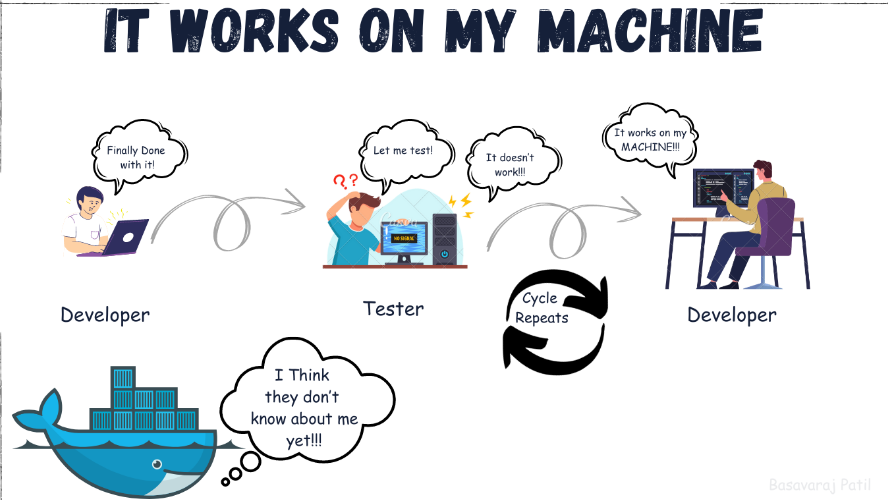
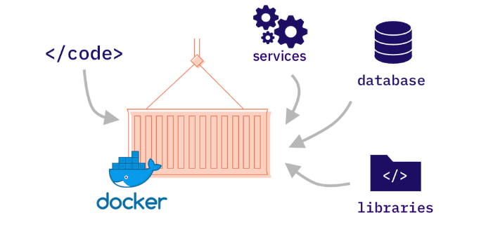

# Buổi 12: Quy trình Deploy cơ bản

## I. Quy trình các bước khi deploy 1 dự án
1. **Chuẩn bị môi trường**: Đảm bảo rằng môi trường phát triển, staging và production đã được thiết lập.
   - Cài đặt các công cụ cần thiết như Git, Docker, Kubernetes, v.v.
   - Kiểm tra cấu hình máy chủ và các dịch vụ liên quan.
2. **Kiểm tra mã nguồn**: Đảm bảo mã nguồn không có lỗi và đã được kiểm thử đầy đủ.
   - Chạy các bài kiểm thử tự động (unit test, integration test).
   - Đảm bảo mã nguồn tuân thủ các tiêu chuẩn coding.
3. **Build ứng dụng**: Tạo các bản build từ mã nguồn.
   - Sử dụng các công cụ như Maven, Gradle, hoặc npm để build.
   - Đóng gói ứng dụng thành các container Docker (nếu cần).
4. **Triển khai ứng dụng**: Đưa ứng dụng lên môi trường staging hoặc production.
   - Sử dụng các công cụ CI/CD như Jenkins, GitHub Actions, GitLab CI/CD.
   - Kiểm tra lại ứng dụng sau khi triển khai.
5. **Giám sát và bảo trì**: Theo dõi hiệu suất và xử lý các vấn đề phát sinh.
   - Sử dụng các công cụ giám sát như Prometheus, Grafana, ELK Stack.
   - Cập nhật và bảo trì định kỳ.

## II. Docker là gì
Hãy tưởng tượng bạn đang xây dựng một dự án phức tạp. Bạn đã dành hàng tuần, thậm chí hàng tháng để viết code , và cuối cùng, nó hoạt động hoàn hảo trên máy tính của bạn. Nhưng khi bạn chia sẻ dự án này với đồng nghiệp hoặc triển khai nó lên một máy chủ, hàng loạt vấn đề phát sinh: lỗi thư viện, xung đột phiên bản, môi trường không tương thích... 

Đây chính là lúc Docker xuất hiện như một vị cứu tinh. **Docker là một nền tảng mở để phát triển, vận chuyển và chạy các ứng dụng trong các môi trường biệt lập gọi là "container"**. Nói một cách đơn giản, Docker cho phép bạn "đóng gói" ứng dụng của mình cùng với tất cả các phụ thuộc của nó - từ thư viện, mã nguồn, cho đến các công cụ hệ thống - vào một "chiếc hộp" duy nhất. Chiếc hộp này có thể được chạy một cách nhất quán trên bất kỳ máy tính nào đã cài đặt Docker, bất kể hệ điều hành hay môi trường bên dưới.

### Lợi ích của Docker:
- **Tính di động**: Container có thể chạy trên bất kỳ máy chủ nào có Docker Engine.
- **Hiệu quả tài nguyên**: Container sử dụng ít tài nguyên hơn so với máy ảo.
- **Dễ dàng quản lý**: Docker cung cấp các công cụ để quản lý và triển khai container dễ dàng.

### Các thành phần chính của Docker:
1. **Docker Engine**: Công cụ chính để chạy và quản lý container.
2. **Docker Image**: Mẫu để tạo container.
3. **Docker Container**: Thực thể đang chạy của một image.
4. **Docker Hub**: Kho lưu trữ các image.

## III. DNS là gì, proxy là gì
### DNS (Domain Name System):
DNS là hệ thống phân giải tên miền, giúp chuyển đổi tên miền (ví dụ: `www.example.com`) thành địa chỉ IP mà máy tính có thể hiểu được.

#### Cách hoạt động của DNS:
1. Người dùng nhập tên miền vào trình duyệt.
2. Trình duyệt gửi yêu cầu đến máy chủ DNS.
3. Máy chủ DNS trả về địa chỉ IP tương ứng.

#### Vai trò của DNS:
- Giúp người dùng dễ dàng truy cập các trang web mà không cần nhớ địa chỉ IP.
- Tăng tốc độ truy cập thông qua bộ nhớ cache DNS.

### Proxy:
Proxy là một máy chủ trung gian giữa người dùng và máy chủ đích. Proxy nhận yêu cầu từ người dùng, sau đó chuyển tiếp yêu cầu đó đến máy chủ đích và trả kết quả về cho người dùng.

#### Các loại proxy:
1. **Forward Proxy**: Đại diện cho người dùng gửi yêu cầu đến máy chủ đích.
2. **Reverse Proxy**: Đại diện cho máy chủ đích xử lý yêu cầu từ người dùng.

#### Lợi ích của proxy:
- **Bảo mật**: Ẩn địa chỉ IP của người dùng.
- **Tăng tốc độ**: Lưu trữ cache để giảm thời gian tải.
- **Kiểm soát truy cập**: Quản lý và giới hạn truy cập vào các tài nguyên.

## IV. Các port thường mở trong dự án
1. **Port 80**: HTTP - Giao thức truyền tải siêu văn bản không mã hóa.
2. **Port 443**: HTTPS - Giao thức truyền tải siêu văn bản có mã hóa.
3. **Port 22**: SSH - Kết nối an toàn đến máy chủ từ xa.
4. **Port 3306**: MySQL - Cơ sở dữ liệu MySQL.
5. **Port 5432**: PostgreSQL - Cơ sở dữ liệu PostgreSQL.
6. **Port 6379**: Redis - Cơ sở dữ liệu NoSQL.
7. **Port 27017**: MongoDB - Cơ sở dữ liệu NoSQL.
8. **Port 8080**: HTTP (thường dùng cho môi trường phát triển).
9. **Port 3000**: Thường dùng cho các ứng dụng Node.js.
10. **Port 5000**: Thường dùng cho các ứng dụng Python Flask.

### Lưu ý:
- Chỉ mở các port cần thiết để giảm thiểu rủi ro bảo mật.
- Sử dụng tường lửa (firewall) để quản lý các port được phép truy cập.

### Thao tác build bằng ./mvnw
`./mvnw` là một wrapper của Maven, giúp đảm bảo rằng bạn có thể chạy các lệnh Maven mà không cần cài đặt Maven trên hệ thống. Dưới đây là các thao tác phổ biến:

1. **Build dự án:**
   ```bash
   ./mvnw clean install
   ```
   - `clean`: Xóa các file build cũ.
   - `install`: Build dự án và cài đặt các gói vào local repository.

2. **Chạy ứng dụng:**
   ```bash
   ./mvnw spring-boot:run
   ```
   - Dùng để chạy ứng dụng Spring Boot trực tiếp mà không cần build thành file JAR.

3. **Kiểm tra mã nguồn:**
   ```bash
   ./mvnw test
   ```
   - Chạy các bài kiểm thử (unit test, integration test).

4. **Build file JAR:**
   ```bash
   ./mvnw package
   ```
   - Đóng gói ứng dụng thành file JAR hoặc WAR trong thư mục `target/`.

5. **Kiểm tra mã nguồn với các plugin:**
   ```bash
   ./mvnw verify
   ```
   - Chạy các kiểm tra bổ sung để đảm bảo chất lượng mã nguồn.

6. **Cập nhật dependencies:**
   ```bash
   ./mvnw dependency:resolve
   ```
   - Kiểm tra và tải về các dependencies cần thiết.

7. **Xem thông tin dự án:**
   ```bash
   ./mvnw help:effective-pom
   ```
   - Hiển thị cấu hình POM đầy đủ sau khi áp dụng các inheritance và profile.