# [BUỔI 2] CƠ BẢN VỀ THIẾT KẾ CƠ SỞ DỮ LIỆU
## I. Lý thuyết về thiết kế cơ sở dữ liệu.
**Thiết kế cơ sở dữ liệu là gì?**
 - Thiết kế cơ sở dữ liệu là quá trình xây dựng cấu trúc cho một CSDL nhằm xác định cách thức lưu trữ, tổ chức và truy cập dữ liệu. Quá trình này bao gồm: 
   - Xác định các yêu cầu của hệ thống
   - Định nghĩa lược đồ CSDL
   - Phân tích các thực thể và mối quan hệ giữa chúng
Xác định các kiểu dữ liệu và phương thức lưu trữ tối ưu nhất. 

**Quá trình thiết kế một CSDL**
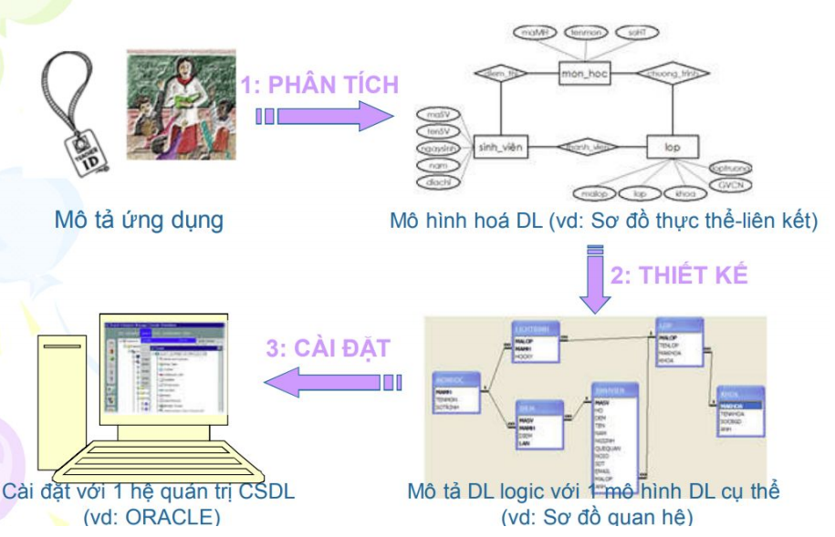
 - Bước 1: Phân tích yêu cầu
   - Suy luận về các use case sẽ được sử dụng để ngăn chặn các vấn đề phát sinh
   - Các yêu cầu về hiệu năng của hệ thống
 - Bước 2: Thiết kế CSDL mức khái niệm
   - Mô tả tổng quát về dữ liệu và các ràng buộc cần thiết trên dữ liệu này
 - Bước 3: Thiết kế CSDL mức logic
   - Thiết kế ở mức trừu tượng cao dựa vào những yêu cầu đã phân tích được, không quan tâm về thiết kế mức vật lý
   - Xác định các loại dữ liệu, kiểu dữ liệu được lưu, và mối quan hệ giữa các thực thể
   - Ở bước này cũng cần cải tiến lược đồ, chuẩn hóa để ngăn chặn dư thừa dữ liệu
 - Bước 4: Thiết kế CSDL mức vật lý
   - Tất cả các mối quan hệ giữa các ràng buộc dữ liệu và tính toàn vẹn được cài đật để duy trì tính nhất quán và tạo cơ sở dữ liệu thực tế
 - Bước 5: Thiết kế an toàn bảo mật
   - Phân quyền vai trò của nhóm người dùng.
## II. Lược đồ quan hệ E-R.
**Tại sao phải sử dụng lược đồ E-R?**
1. Các sơ đồ ER đại diện / ánh xạ cho lược đồ E-R trong cơ sở dữ liệu, giúp 
chúng dễ dàng chuyển đổi thành các quan hệ (bảng). 
2. Các sơ đồ ER cung cấp mục đích của mô hình trong thế giới thực của các 
đối tượng. 
3. Cung cấp một giải pháp tiêu chuẩn để trực quan hóa dữ liệu một cách hợp lý.
   
**Mô hình thực thể-liên kết (Entity-Relationship, viết tắt ER)** là một mô hình dữ liệu mức quan niệm nhằm mô tả các đối tượng trong thế giới thực và quan hệ giữa 
chúng
**Các ký pháp**

Khái niệm:
**Thực thể** : Một thực thể là một điều gì đó hoặc một đối tượng nào đó trong thế giới thực mà có thể phân biệt được được với các đối tượng khác. Một thực thể được biểu diễn bởi một tập các thuộc tính.
 - Vdu: *Một thực thể có thể hiện thực như là một người hoặc một quyển sách hoặc có thể trừu tượng như một khoản vay từ nhà băng hoặc một khái niệm nào đó.* 

**Tập thực thể** :Một tập các thực thể là một tập hợp các thực thể cùng loại, có chung các thuộc tính. 
 - *Ví dụ, tập hợp tất cả các người là khách hàng của một ngân hàng nào đó có thể được định nghĩa như một tập hợp các khách hàng.*

**Thực thể mạnh :** Một thực thể mạnh là một loại thực thể có khóa chính. Thực mạnh không phụ thuộc vào thực thể khác trong lược đồ. Nó có một khóa chính, giúp xác định nó một cách duy nhất. 
 - *Ví dụ: thực thể NHÂN VIÊN, CÔNG TY*.

**Thực thể yếu :** kiểu thực thể mà sự tồn tại của nó phải phụ thuộc vào sự tồn tại của một thực thể khác hay thực thể yếu chỉ tồn tại trong hệ thống khi có sự tồn tại của một thực thể khác trong hệ thống. 
 - *Ví dụ: thực thể THÂN NHÂN trong hệ thống quản lý nhân viên, một thân nhân chỉ được quản lý nếu thân nhân đó đi kèm với một nhân viên cụ thể, ngược lại nếu không có nhân viên trong hệ thống thì không có thân nhân nào được quản lý.*

**Thuộc tính :** Là 1 đặc trưng mà trị của nó tham gia vào việc mô tả một thực thể. Mỗi thuộc tính có một tập giá trị cho phép, được gọi là miền (hay tập giá trị) của thuộc tính đó.
 - *VD: Người thì có tên, tuổi thì tên, tuổi ở đây là thuộc tính*.

**Thuộc tính đa trị :** Một thuộc tính đa trị có thể có nhiều giá trị khác nhau tại một thời điểm cụ thể. 
 - *VD: Một người có thể có nhiều số điện thoại, thì số điện thoại chính là thuộc tính đa trị*.

**Thuộc tính dẫn suất :** Đây là một thuộc tính mà giá trị của nó được phát sinh (hay được tính toán) từ các giá trị của các thuộc tính liên quan hoặc các thực thể liên quan.

**Liên kết :** Một mối quan hệ hay liên kết là một sự liên hệ giữa một vài thực thể. Ví dụ chúng ta có thể định nghĩa một mối liên kết thể hiện bạn là một sinh viên của một lớp học nào đó. Mối quan hệ này xác nhận rằng bạn đã đăng ký học lớp đó. Về mặt hình thức, một mối quan hệ là một tập các quan hệ cùng loại.

**Tham gia đầy đủ :** Sự tham gia của một tập thực thể E trong một tập các mối quan hệ R được cho là đầy đủ nếu mọi thực thể của E tham gia vào ít nhất một mối quan hệ của R.
 - *VD: Thực thể KHOẢN VAY tham gia đầy đủ vào NGƯỜI CHO MƯỢN. Mỗi KHOẢN VAY luôn phải liên quan đến ít nhất một NGƯỜI CHO MƯỢN. Không có khoản vay nào tồn tại mà không được ai cho vay → KHOẢN VAY tham gia đầy đủ vào mối quan hệ NGƯỜI CHO MƯỢN.*

**Tham gia một phần :** Nếu chỉ có một vài thực thể của E tham gia vào một mối quan hệ trong R thì sự tham gia của tập thực thể E tới tập các mối quan hệ R được cho là một phần  
 - *VD: Thực thể NGƯỜI ĐI MƯỢN có thuộc tính KHOẢN VAY tham gia 1 phần vào NGƯỜI CHO MƯỢN. Không phải mọi NGƯỜI ĐI MƯỢN đều đang mượn tiền. Có thể có những người trong hệ thống (đã đăng ký), nhưng chưa từng vay khoản nào → NGƯỜI ĐI MƯỢN chỉ tham gia một phần vào mối quan hệ NGƯỜI CHO MƯỢN*.

**Khóa chính :** Khóa chính của một tập thực thể cho phép bạn phân biệt các thực thể khác nhau trong một tập. Mỗi thực thể chỉ có một khóa chính, nhưng mà một khóa chính có thể chứa nhiều thuộc tính. Khóa chính không được phép null.
 - *Ví dụ: sdt có là khóa chính được ko? => được, nhưng ko nên. Vì khóa chính là trường ko nên dễ bị thay đổi*

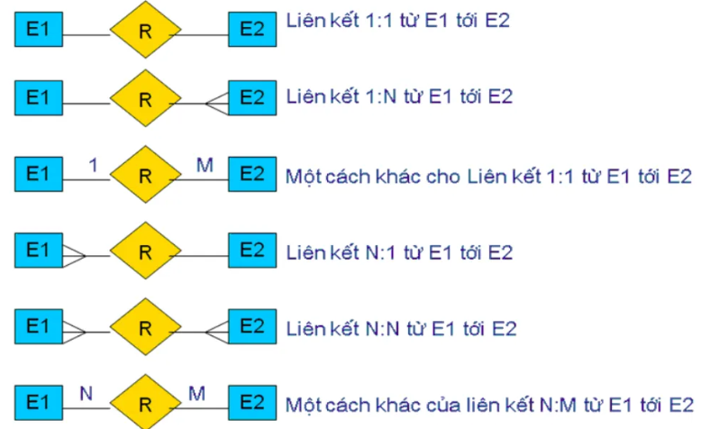

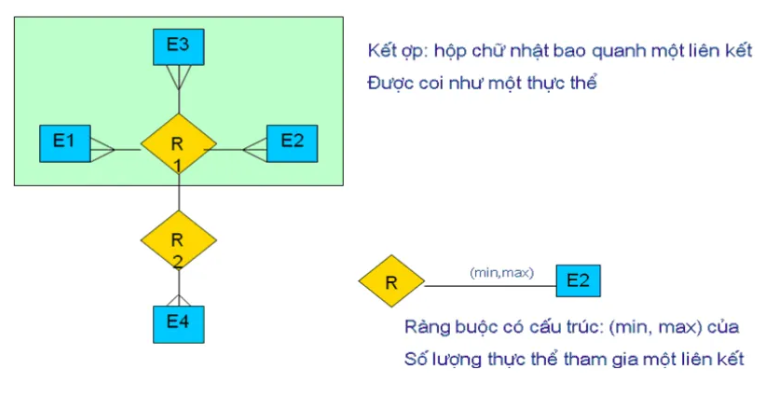

### Đặt vị trí cho các thuộc tính của quan hệ
**Đối với Quan hệ 1-1**
- **Quy tắc:** Có thể gộp hai bảng làm một, hoặc lấy khóa chính của bảng này làm khóa ngoại cho bảng kia.
- **Lựa chọn:**
  - Nếu một bên có thể không tồn tại (ví dụ: không phải nhân viên nào cũng có xe công ty), thì nên tách làm 2 bảng. Khóa ngoại sẽ được đặt ở bảng "tùy chọn" đó.
  - Khóa ngoại trong quan hệ 1-1 phải được thiết lập là duy nhất (UNIQUE).
- **Ví dụ:** Một `NHAN_VIEN` có một `TAI_KHOAN` đăng nhập hệ thống.
  - Bảng `NHAN_VIEN` (`MaNV`, `HoTen`)
  - Bảng `TAI_KHOAN` (`TenDangNhap`, `MatKhau`, `MaNV`). Cột `MaNV` vừa là khóa ngoại, vừa phải là UNIQUE.

**Đối với Quan hệ 1-N:**
- **Quy tắc:** Lấy khóa chính của bảng bên "1" (bảng cha) bỏ vào bảng bên "N" (bảng con) để làm khóa ngoại.
- **Ví dụ:** Một `LỚP` có nhiều `SINH_VIÊN`. Ta sẽ thêm cột `MaLop` (khóa chính của bảng `LỚP`) vào bảng `SINH_VIÊN`.
- **Thuộc tính của quan hệ (nếu có):** Đặt ở bảng bên "N".

**Đối với Quan hệ N-N**
- **Quy tắc:** Tạo một bảng mới (bảng trung gian/bảng nối) để thể hiện mối quan hệ.
- **Bảng trung gian chứa:** Ít nhất hai cột, mỗi cột là một khóa ngoại trỏ về khóa chính của hai bảng gốc.
- **Ví dụ:** Một `SINH_VIÊN` đăng ký nhiều `MON_HOC`. Ta tạo bảng `DANG_KY` chứa `MaSV` và `MaMH`.
- **Thuộc tính của quan hệ (nếu có):** Đặt ở bảng trung gian. Ví dụ: thuộc tính `DiemThi` sẽ nằm trong bảng `DANG_KY`.

## III. Mô hình dữ liệu quan hệ.
- Mô hình dữ liệu quan hệ được phát triển dựa trên khái niệm về quan hệ toán 
học. Mô hình này liên quan chủ yếu đến lý thuyết tập hợp và logic mệnh đề.
- **Quan hệ** là một bảng (ma trận) với các hàng và các cột, lưu giữ thông tin về 
các đối tượng được mô hình hóa trong CSDL.
- **Thuộc tính** là các cột được đặt tên trong một quan hệ. Mỗi thuộc tính là một 
đặc tính của một thực thể (hay một quan hệ) được mô hình hóa trong CSDL. 
Các thuộc tính có thể xuất hiện theo bất kỳ thứ tự nào trong quan hệ.
- **Miền giá trị** là một tập các giá trị có thể có của một hoặc nhiều thuộc tính. 
Mỗi thuộc tính được xác định trên một miền giá trị.
- **Bộ** là một hàng của một quan hệ. Các bộ có thể xuất hiện theo bất kỳ thứ tự 
nào trong quan hệ.
- **Bậc (cấp)** của một quan hệ là số lượng các thuộc tính mà nó có
- **Lực lượng** là số lượng các bộ mà một quan hệ có.
- **Cơ sở dữ liệu quan hệ** là một tập hợp các quan hệ được chuẩn hóa với 
các tên phân biệt nhau.
### Ánh xạ mô hình thực thể liên kết sang mô hình quan hệ
**Bước 1: Dùng cho việc ánh xạ các thực thể thông thường (thực thể mạnh)**
- Mỗi thực thể thông thường trong mô hình thực thể liên kết sẽ được chuyển đổi thành một lược đồ quan hệ.
- Tên của quan hệ thường là tên của loại thực thể.
- Mỗi thuộc tính đơn của loại thực thể trở thành một thuộc tính của lược đồ quan hệ
- Thuộc tính định danh trở thành khóa chính của quan hệ tương ứng.
Ví dụ:
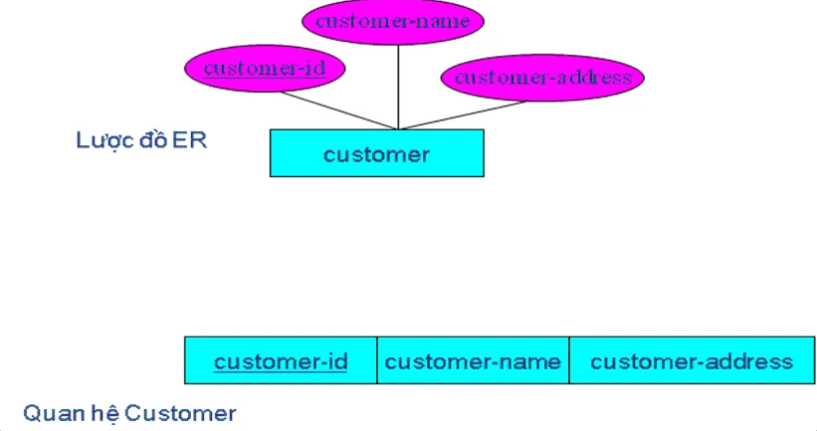

 - **Thuộc tính kép:** Nếu thực thể có thuộc tính kép thì chỉ những thuộc tính đơn của thuộc tính kép này được đưa vào lược đồ quan hệ mới.
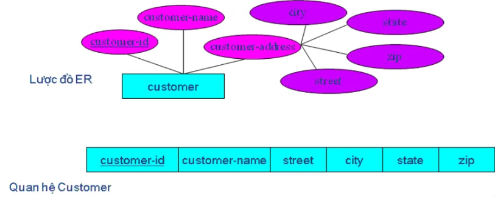

 - **Thuộc tính đa trị:** Nếu một thực thể thường có một thuộc tính đa trị thì hai lược đồ quan hệ mới sẽ được tạo ra.
  1. Lược đồ quan hệ thứ nhất chứa tất cả các thuộc tính của thực thể trừ thuộc tính đa trị.
  2. Lược đồ quan hệ thứ hai sẽ có hai thuộc tính cấu thành khóa chính.
  ● Thuộc tính thứ nhất là khoá chính của lược đồ quan hệ thứ nhất
  => nó sẽ trở thành khóa ngoại trong lược đồ thứ hai.
  ● Thuộc tính thứ hai là thuộc tính đa trị.
  Tên của lược đồ thứ hai nên được đặt để thể hiện ngữ nghĩa của thuộc tính đa trị.
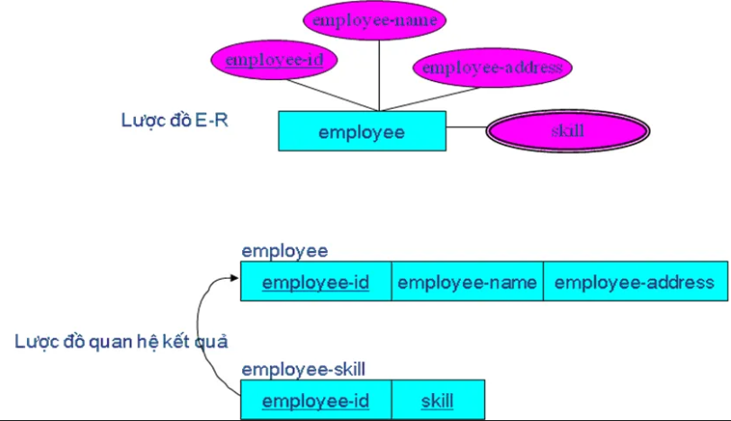

**Bước 2: Ánh xạ các thực thể yếu**
- Nhắc lại rằng một thực thể yếu không thể tồn tại độc lập, chỉ có thể tồn tại thông qua một quan hệ xác định với một loại thực thể khác được gọi là chủ thể.
- Một thực thể yếu không có một định danh đầy đủ mà phải có một thuộc tính được gọi là định danh một phần cho phép phân biệt các thể hiện khác nhau của loại thực thể yếu này cho mỗi thể hiện của thực thể chủ.
- Đối với mỗi loại thực thể yếu, tạo một lược đồ quan hệ mới và đưa tất cả các thuộc tính đơn (hoặc các thành phần đơn của các thuộc tính ghép) vào thành thuộc tính của lược đồ quan hệ này.
- Sau đó thêm khóa chính của quan hệ xác định vào thành một thuộc tính khóa ngoài trong lược đồ quan hệ mới.
- Khóa chính của lược đồ quan hệ mới là sự kết hợp của khoá chính của quan hệ xác định và định danh một phần của loại thực thể yếu.
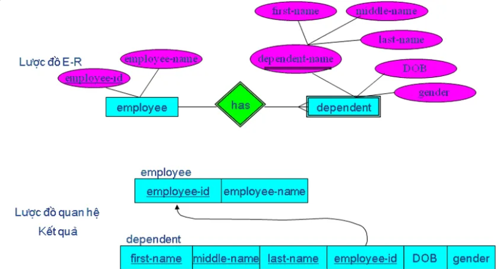

**Bước 3: Ánh xạ các liên kết hai ngôi**

***Quan hệ 1-N***

- Với mỗi quan hệ 1-N, đầu tiên tạo một lược đồ quan hệ cho mỗi loại thực thể tham gia vào mối quan hệ sử dụng các thủ tục ở bước 1.
- Sau đó, thêm thuộc tính khóa chính (hoặc các thuộc tính) của thực thể bên phía 1 của mối quan hệ thành một khóa ngoại cho quan hệ nằm ở bên phía nhiều của mối quan hệ (khóa chính lấy từ bên phía nhiều của mối quan hệ).
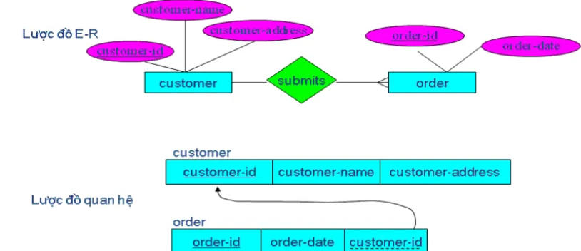

***Quan hệ N-N***
 - Cho quan hệ hai ngôi N-N giữa hai thực thể A và B.
 - Đầu tiên phải tạo thêm một lược đồ quan hệ mới C. Khóa của lược đồ C là sự kết hợp khóa chính của các tập thực thể tham gia vào quan hệ và các khóachính này cũng là khóa ngoại của C.
 - Các thuộc tính không phải là khóa mà liên quan tới quan hệ N-N giữa A và B cũng được đưa vào lược đồ quan hệ C.

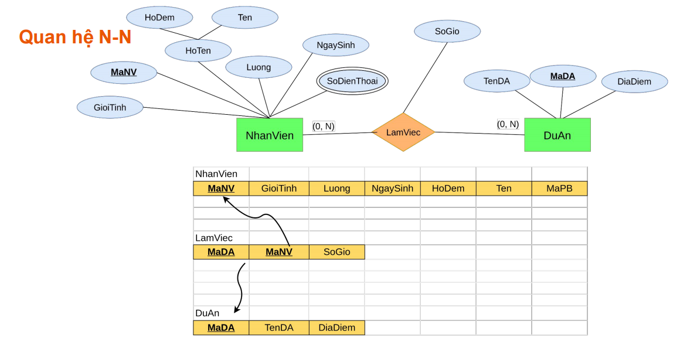

 - Có 3 quan hệ được tạo ra: 2 quan hệ liên quan tới các thực thể tham gia vào liên kết, còn quan hệ thứ ba cho thực thể kết hợp, gọi là quan hệ kết hợp.
 - Bước này phụ thuộc vào việc có gán một định danh cho thực thể kết hợp trong lược đồ E-R hay không. Có 2 trường hợp xảy ra:
  ➢ Không gán định danh

  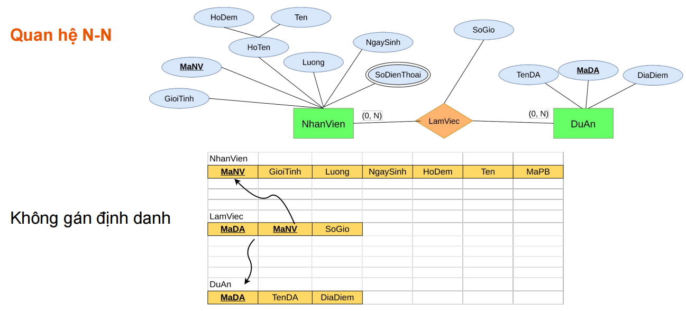

  ➢ Có gán định danh 
  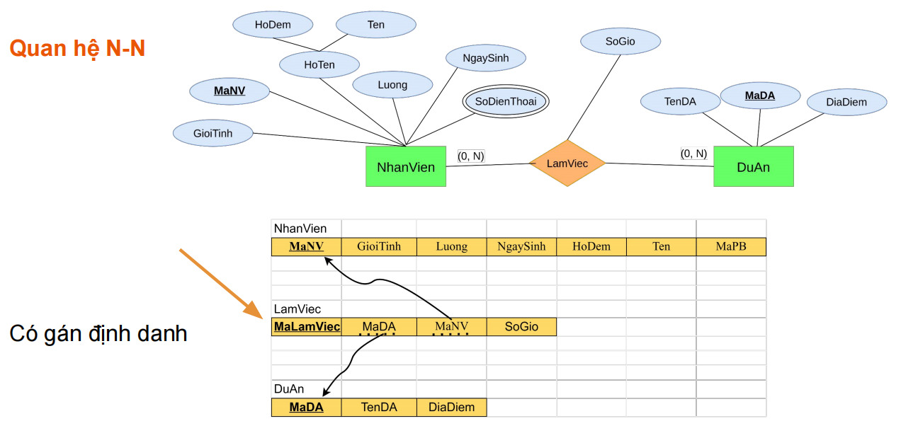
***Quan hệ 1-1***
Quá trình này cần qua hai bước:
- Hai quan hệ được tạo ra, mỗi quan hệ liên quan tới một loại thực thể tham gia mối quan hệ đó.
- Khóa chính của một quan hệ sẽ thành khóa ngoài trong quan hệ còn lại.
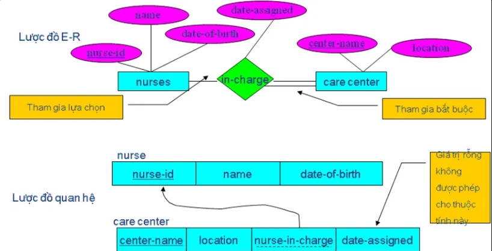
date-assigned không được null.

**Bước 4: Ánh xạ các quan hệ đệ quy**
***Quan hệ 1-N***
Tập thực thể trong quan hệ một ngôi được ánh xạ thành một lược đồ quan hệ sử dụng một thủ tục được mô tả trong bước 1. Tiếp đến một thuộc tính khóa ngoại được thêm vào cùng quan hệ có tham chiếu tới các giá trị của khóa chính (khóa ngoại này phải có cùng miền giá trị với khóa chính). Một khóa ngoại đệ quy là một khóa ngoại của một quan hệ mà tham chiếu tới giá trị khóa chính của cùng quan hệ đó.

***Quan hệ N-N***
Với loại quan hệ đệ quy loại này, hai lược đồ quan hệ sẽ được tạo ra: một thể hiện tập thực thể và lược đồ quan hệ liên kết để thể hiện mối quan hệ nhiều-nhiều. Khóa chính của quan hệ liên kết bao gồm hai thuộc tính. Những thuộc tính này (không nhất thiết phải có cùng tên) đều lấy giá trị của chúng từ các khóa chính của quan hệ còn lại. Các thuộc tính không khóa của quan hệ được thêm vào quan hệ liên kết. Ví dụ của trường hợp này về mối quan hệ phát sinh hóa đơn cho các nhiên vật liệu của các linh kiện được lắp ráp từ những linh kiện khác được thể hiện trong  hình vẽ dưới đây.
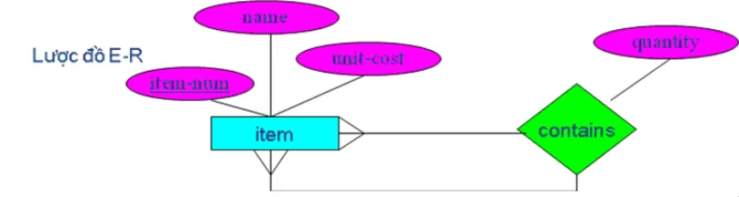

hoặc ví dụ:
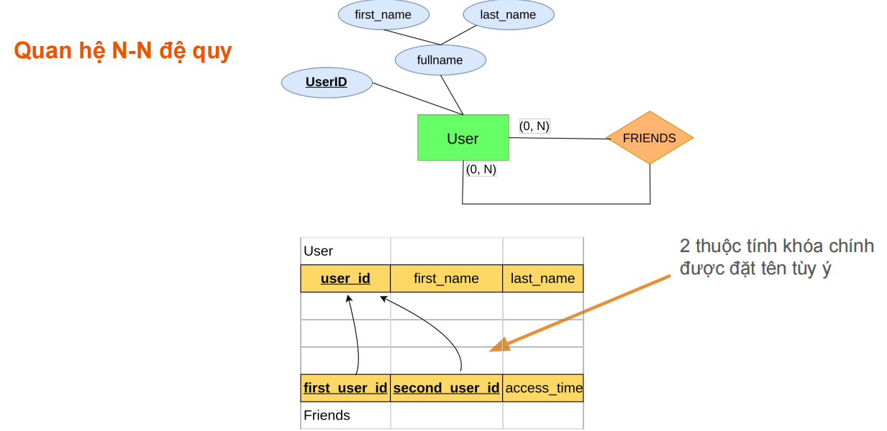
**Bước 5: Ánh xạ các quan hệ nhiều ngôi**
Nhắc lại rằng một mối quan hệ ba ngôi được định nghĩa như một mối quan hệ giữa ba tập thực thể như được biểu diễn trong hình vẽ dưới đây
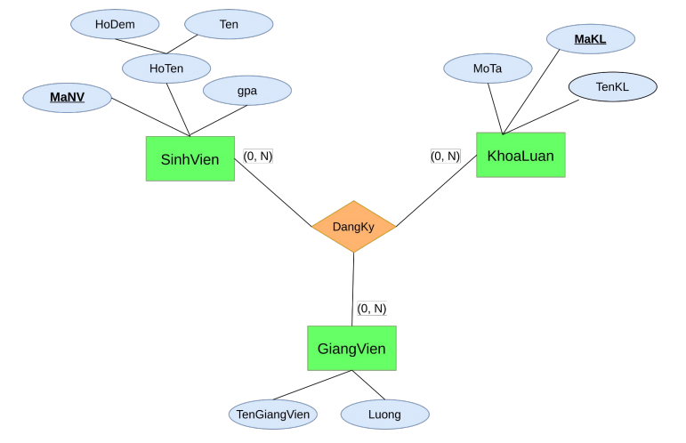
 - Một nhắc nhở về quan hệ nhiều ngôi: tất cả nên chuyển đổi về các thực thể liên kết trước khi được xử lý sâu hơn. 
- Để ánh xạ một thực thể kết hợp kết nối ba tập thực thể loại thường, cần tạo ra một quan hệ kết hợp mới.
 - Khóa chính ngầm định cho quan hệ kết hợp gồm các thuộc tính khóa chính của các thực thể tham gia liên kết (trong một số trường hợp cần thêm các thuộctính khác để hình thành một khóa chính duy nhất). Các thuộc tính này được coi là các khóa ngoại tham chiếu tới từng khóa chính của các tập thực thể tham gia liên kết.
 -  Mỗi thuộc tính của thực thể kết hợp trở thành thuộc tính trong quan hệ kết hợp mới.
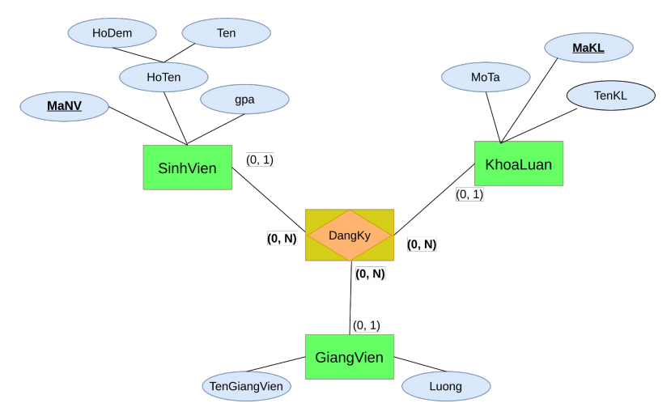
## IV. Chuẩn hóa dữ liệu: 1NF, 2NF, 3NF.
### 4.1. Khái niệm
- Chuẩn hóa là quá trình tách bảng (phân rã) thành các bảng nhỏ hơn dựa vào các phụ thuộc hàm. Các dạng chuẩn hóa là các chỉ dẫn để thiết kế các bảng trong CSDL.
### 4.2. Mục đích
- Loại bỏ các dư thừa dữ liệu
- Tăng tốc độ truy vấn
- Dữ liệu rõ ràng, dễ kiểm soát
### 4.3. Các dạng chuẩn hóa
Các dạng chuẩn hóa
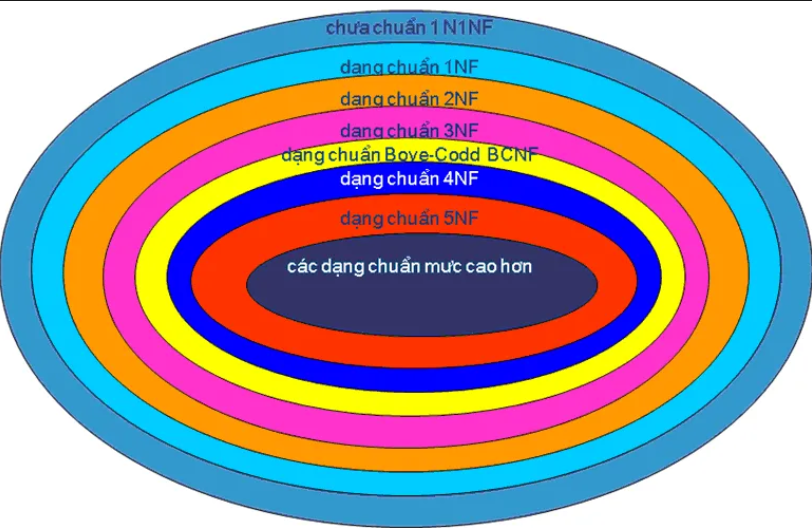
Các dạng chuẩn hóa cơ bản
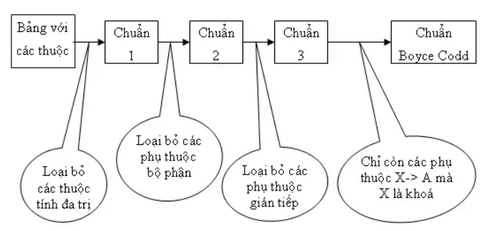

#### 4.3.1. 1NF
Một bảng (quan hệ) được gọi là ở dạng chuẩn 1NF nếu và chỉ nếu:
- Mọi thuộc tính của quan hệ đều ở dạng nguyên tố.
- không có thuộc tính đa trị.
- không có thuộc tính dẫn xuất.

VD:
PhongBan(<u>id</u>, tên, địa điểm)

⇒ PhongBan(<u>id</u>, tên), DD_PhongBan(<u>id</u>, địa điểm)
#### 4.3.2. 2NF
Một quan hệ ở dạng chuẩn 2NF nếu quan hệ đó:

- Là 1NF.
- Mọi thuộc tính không khóa phải phụ thuộc đầy đủ vào khóa chính (không phụ thuộc một phần).

VD: 

NV_DV(<u>MaNV, MaDV</u>, SoGio, TenNV, TenDV)

SoGio phụ thuộc đúng vào cả 2 thuộc tính của khóa chính ⇒ OK
TenNV chỉ phụ thuộc vào MaNV ⇒ phụ thuộc một phần ⇒ vi phạm 2NF.
TenDV chỉ phụ thuộc vào MaDV ⇒ phụ thuộc một phần ⇒ sai 2NF

=>Tách chuẩn theo 2NF:
NV(<u>MaNV</u>, TenNV)
DV(<u>MaDV</u>, TenDV)
NV_DV(<u>MaNV, MaDV</u>, SoGio)

#### 4.3.3. 3NF
Một quan hệ ở dạng chuẩn 3NF nếu quan hệ đó:

- Là 2NF
- Mọi thuộc tính không khóa phải phụ thuộc trực tiếp vào khóa chính, không qua trung gian (không phụ thuộc bắc cầu).

VD:

NV_DV(<u>MaNV</u>, TenNV, MaDV, TenDV)

TenDV phụ thuộc vào MaDV

MaDV phụ thuộc vào MaNV

⇒ TenDV phụ thuộc bắc cầu qua MaDV, không trực tiếp vào MaNV ⇒ vi phạm 3NF.

⇒ NV_DV(<u>MaNV</u>, TenNV, MaDV), DV(<u>MaDV</u>, TenDV)
#### 4.3.4. BCNF (Boyce–Codd Normal Form)
- Quan hệ đó ở dạng chuẩn 3NF
- Mọi phụ thuộc hàm X → Y đều thỏa mãn: X là siêu khóa
***Siêu khóa  là tập một hoặc nhiều thuộc tính trong một bảng dùng để phân biệt duy nhất mỗi bản ghi trong bảng đó.
Khóa chính là một siêu khóa tối thiểu, tức là ít cột nhất có thể nhưng vẫn đảm bảo duy nhất.***

VD:
PHAN_CONG(<u>MaNV, MaDV</u>, TenNV, TenDV, ThoiGian)'

TenNV phụ thuộc vào MaNV
TenDV phụ thuộc vào MaDV
ThoiGian phụ thuộc vào MaNV, MaDV

Khóa chính(siêu khóa tối thiểu): MaNV, MaDV

Nhưng có TenNV phụ thuốc vào MaNV không phải siêu khóa ⇒ Vi phạm BCNF.
Tách ra quan hệ sau:

NV(<u>MaNV</u>, TenNV)

DV(<u>MaDV</u>, TenDV)

PHAN_CONG(<u>MaNV, MaDV</u>, ThoiGian)