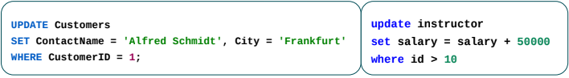
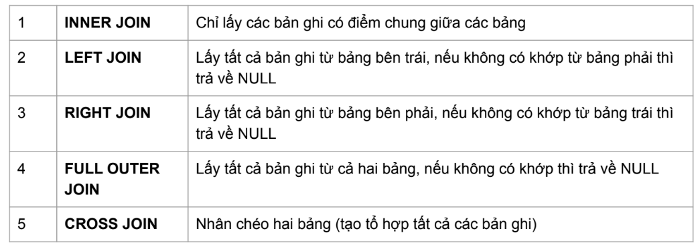
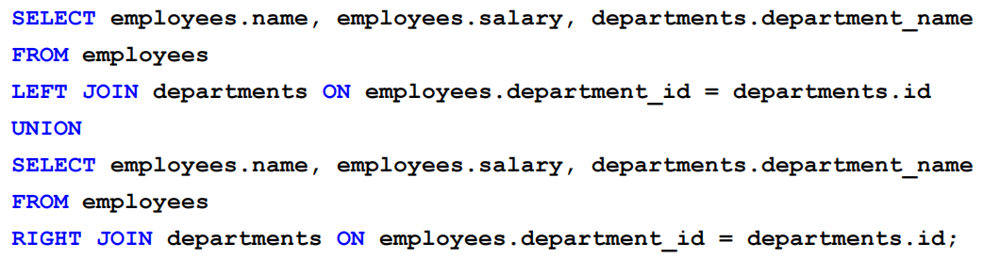
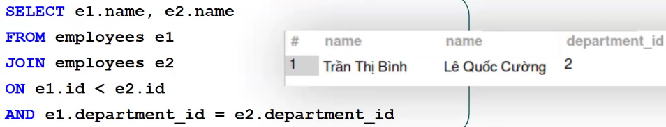
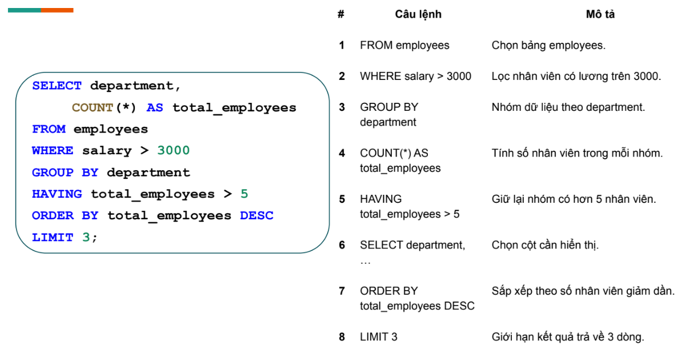

# [BUỔI 3] SQL cơ bản
## I. Các thao tác cơ bản: SELECT, INSERT, UPDATE, DELETE, từ khóa AS, DISTINCT
### 1. SELECT
- **select** liệt kê các thuộc tính mong muốn trong kết quả của truy vấn
```sql
select name from SinhVien
```
- SQL cho phép trùng lặp trong các quan hệ cũng như trong kết quả truy vấn.SQL cho phép trùng lặp trong các quan hệ cũng như trong kết quả truy vấn.
- Để loại bỏ các mục trùng lặp, hãy chèn từ khóa distinct sau lệnh select.
```sql
select distinct name from SinhVien
```
- Dấu `*` thể hiện muốn lấy tất cả các trường
- Mệnh đề select có thể chứa các biểu thức số học liên quan đến phép toán +, –, *, /, và phép toán trên hằng số hoặc thuộc tính.


### 2. INSERT
- Câu lệnh **INSERT INTO** được sử dụng để chèn bản ghi mới vào bảng.

```sql
INSERT INTO table_name (column1, column2, column3, ...)
VALUES (value1, value2, value3, ...);
```
```sql
INSERT INTO Student (StudentID, Name, Age)
VALUES (1, 'An', 20);
```
- Chỉ định rõ cột nào nhận giá trị nào, nên thứ tự không quan trọng miễn là khớp nhau.

```sql
INSERT INTO table_name
VALUES (value1, value2, value3, ...);
```
```sql
INSERT INTO Student
VALUES (2, 'Bình', 21);
```
- Nếu muốn thêm giá trị cho tất cả các cột của bảng, cần đảm bảo đúng thứ tự của các cột trong bảng. Phải chèn đầy đủ tất cả các cột (trừ khi cột đó có giá trị mặc định hoặc cho phép NULL)
```sql
INSERT INTO table2
SELECT * FROM table1
WHERE condition;
```
```sql
INSERT INTO GraduatedStudents
SELECT * FROM Students
WHERE YearGraduated = 2024;
```
Dùng khi muốn sao chép dữ liệu từ table1 sang table2.
table1 và table2 phải có cùng số lượng và kiểu dữ liệu cột, theo đúng thứ tự.
```sql
INSERT INTO table2 (column1, column2, column3, ...)
SELECT column1, column2, column3, ...
FROM table1
WHERE condition;
```
```sql
INSERT INTO Alumni (ID, FullName)
SELECT StudentID, Name
FROM Students
WHERE YearGraduated = 2024;
```
Linh hoạt hơn cách số 3 vì bạn có thể chọn cột phù hợp từ table1.
Có thể dùng để chuyển dữ liệu giữa 2 bảng có cấu trúc khác nhau.
### 2.2. UPDATE
- UPDATE được sử dụng để sửa đổi các bản ghi hiện có trong một bảng.
```sql
UPDATE table_name
SET column1 = value1, column2 = value2, ...
WHERE condition;
```
- ví dụ:

### 2.3. DELETE
- DELETE được sử dụng để xóa các bản ghi hiện có trong một bảng
```sql
DELETE FROM table_name WHERE condition;
```
```sql
DELETE tb1
FROM 
    Table1 tb1
    INNER JOIN Table2 tb2 ON tb2.key = tb1.key
WHERE ...
```
```sql
DELETE o
FROM Orders o
INNER JOIN Customers c ON o.CustomerID = c.CustomerID
WHERE c.Country = 'Germany';
```
Xóa tất cả Orders của Customers ở Đức.

### 2.4 AS
- Dùng để đặt bí danh (alias) cho cột hoặc bảng, giúp tên hiển thị dễ đọc hơn hoặc rút gọn khi viết.
- Từ khóa `AS` có thể bỏ qua trong nhiều hệ quản trị (viết alias trực tiếp sau tên cột/bảng).

Ví dụ:
```sql
-- Alias cho cột
SELECT Name AS HoTen, AvgScore AS DiemTB FROM SinhVien;

-- Alias cho bảng
SELECT s.Name, s.AvgScore
FROM SinhVien AS s;

-- Alias dùng trong biểu thức
SELECT (Score1 + Score2)/2 AS DiemTrungBinh
FROM KetQua;
```

Lưu ý:
- Alias chỉ có hiệu lực trong phạm vi truy vấn hiện tại.
- Khi alias có khoảng trắng hoặc ký tự đặc biệt, cần dùng dấu ngoặc vuông hoặc nháy kép tùy DBMS (ví dụ: "Tổng tiền").

### 2.5 DISTINCT
- Loại bỏ các dòng trùng lặp trong kết quả trả về, chỉ giữ các dòng duy nhất dựa trên danh sách cột chọn.

Ví dụ:
```sql
-- Danh sách lớp không trùng lặp
SELECT DISTINCT class FROM SinhVien;

-- Kết hợp nhiều cột: cặp giá trị duy nhất (class, gender)
SELECT DISTINCT class, gender FROM SinhVien;
```

Lưu ý:
- `DISTINCT` áp dụng cho toàn bộ danh sách cột phía sau nó, không phải từng cột riêng lẻ.
- `DISTINCT` có thể tốn chi phí xử lý trên dữ liệu lớn (do cần sắp xếp hoặc băm để loại trùng).
## II. Lọc dữ liệu: WHERE, HAVING

### 1. WHERE
- Vị trí: `WHERE` được sử dụng ngay sau mệnh đề `FROM` (và sau `JOIN` nếu có) và trước `GROUP BY`, `HAVING`, `ORDER BY`.
- Chức năng: lọc các hàng (rows) trước khi thực hiện nhóm hoặc các phép toán tổng hợp (aggregation).

    Cú pháp chung:
```sql
SELECT column_list
FROM table_name
WHERE condition;
```

    Ví dụ cơ bản:
```sql
-- Lấy sinh viên có điểm trung bình >= 7
SELECT StudentID, Name, AvgScore
FROM SinhVien
WHERE AvgScore >= 7;
```

    Một số dạng điều kiện thường dùng trong `WHERE`:
- So sánh: `=`, `<>`/`!=`, `>`, `<`, `>=`, `<=`
- Logic: `AND`, `OR`, `NOT`
- Phạm vi: `IN (val1, val2, ...)`, `BETWEEN x AND y`
- Mẫu: `LIKE '%pattern%'`, có thể dùng ký tự đại diện `%` và `_`
- Kiểm tra NULL: `IS NULL`, `IS NOT NULL`
- Kiểm tra tồn tại: `EXISTS (subquery)`

    Ví dụ nâng cao:
```sql
-- Các đơn hàng trong tháng 7 năm 2024 từ các khách hàng có ID trong danh sách
SELECT OrderID, CustomerID, OrderDate, TotalAmount
FROM Orders
WHERE CustomerID IN (101, 102, 103)
    AND OrderDate BETWEEN '2024-07-01' AND '2024-07-31'
    AND TotalAmount > 0;
```

    Lưu ý kỹ thuật:
- `WHERE` không thể sử dụng trực tiếp các hàm tổng hợp như `SUM()`, `COUNT()` trên kết quả đã nhóm — những điều kiện này phải dùng `HAVING`.
- `WHERE` thường nhanh hơn cho lọc nếu có chỉ mục (index) trên cột được so sánh.

### 2. HAVING
- Vị trí: `HAVING` xuất hiện sau `GROUP BY` và trước `ORDER BY`.
- Chức năng: lọc các nhóm (groups) đã được tạo bởi `GROUP BY`, dựa trên các biểu thức tổng hợp như `COUNT()`, `SUM()`, `AVG()`, `MAX()`, `MIN()`.

    Cú pháp chung:
```sql
SELECT group_cols, aggregate_functions
FROM table_name
WHERE row_conditions
GROUP BY group_cols
HAVING group_conditions;
```

    Ví dụ cơ bản:
```sql
-- Tìm các khách hàng có tổng đơn hàng > 1000
SELECT CustomerID, SUM(TotalAmount) AS TotalPerCustomer
FROM Orders
GROUP BY CustomerID
HAVING SUM(TotalAmount) > 1000;
```

    Ví dụ kết hợp WHERE và HAVING:
```sql
-- Trong năm 2024, tìm các sản phẩm có số lượng bán trung bình > 50
SELECT ProductID, SUM(Quantity) AS TotalQty, AVG(Quantity) AS AvgQty
FROM OrderDetails od
JOIN Orders o ON od.OrderID = o.OrderID
WHERE o.OrderDate BETWEEN '2024-01-01' AND '2024-12-31'
GROUP BY ProductID
HAVING AVG(Quantity) > 50;
```

    Lưu ý:
- `HAVING` dùng để lọc sau khi đã nhóm, vì vậy bạn có thể dùng các hàm tổng hợp trong điều kiện `HAVING`.
- Một số hệ quản trị cơ sở dữ liệu (DBMS) cho phép dùng `HAVING` mà không cần `GROUP BY` để lọc theo toàn bộ tập kết quả tổng hợp (ví dụ: `HAVING COUNT(*) > 1` sẽ áp dụng trên toàn bộ tập kết quả), nhưng đây không phải là cách phổ biến — luôn kiểm tra hành vi trên DB cụ thể.

### Vậy
- Dùng `WHERE` để lọc hàng. Dùng `HAVING` để lọc nhóm (sau `GROUP BY`).
- Thói quen tốt: lọc thô bằng `WHERE` trước, rồi nhóm và lọc chi tiết bằng `HAVING`.


## III. Kết hợp bảng và kết quả: JOIN, UNION
### Join
- JOIN được sử dụng để kết hợp các hàng từ hai hoặc nhiều bảng, dựa trên cột có liên quan giữa chúng.

 #### Khi nào nên dùng ON, khi nào nên dùng WHERE

- **ON**: Dùng để chỉ định điều kiện kết nối (join condition) giữa các bảng.
  - Đặt sau mệnh đề JOIN (`INNER JOIN`, `LEFT JOIN`, `RIGHT JOIN`...)
  - Xác định cột nào ở bảng này khớp với cột nào ở bảng kia
  
  ```sql
  SELECT * 
  FROM Orders o
  INNER JOIN Customers c ON o.CustomerID = c.CustomerID;
  ```

- **WHERE**: Dùng để lọc kết quả sau khi các bảng đã được kết nối.
  - Đặt sau tất cả các mệnh đề JOIN
  - Áp dụng điều kiện lọc trên kết quả đã join
  
  ```sql
  SELECT * 
  FROM Orders o
  INNER JOIN Customers c ON o.CustomerID = c.CustomerID
  WHERE c.Country = 'Vietnam' AND o.TotalAmount > 1000;
  ```

**Nguyên tắc đơn giản:**
- `ON` → điều kiện **kết nối** bảng
- `WHERE` → điều kiện **lọc** kết quả

**Lưu ý quan trọng với FULL OUTER JOIN:**
- MYSQL không hỗ trợ trực tiếp FULL OUTER JOIN ⇒ UNION (LEFT, RIGHT)


**CROSS JOIN** Khá nguy hiểm khi sử dụng, ít dùng. trừ khi bắt tính tất cả các trường hợp có thể xảy ra mới dùng.

**SELF JOIN** là JOIN bình thường nhưng kết hợp với chính nó
 - *Ví dụ*: Tìm các cặp nhân viên cùng phòng ban với nhau

## IV. Tổng hợp và nhóm dữ liệu: COUNT, SUM, AVG, GROUP BY

### 1) Tổng hợp dữ liệu với các hàm COUNT, SUM, AVG
- **COUNT()**: Đếm số lượng bản ghi (rows) hoặc số lượng giá trị khác NULL của một cột.
    - `COUNT(*)`: Đếm tất cả các dòng.
    - `COUNT(column)`: Đếm số dòng có giá trị khác NULL ở cột đó.
    - Ví dụ:
        ```sql
        SELECT COUNT(*) FROM SinhVien; -- Đếm tổng số sinh viên
        SELECT COUNT(DISTINCT class) FROM SinhVien; -- Đếm số lớp khác nhau
        ```

- **SUM()**: Tính tổng các giá trị số của một cột.
    - Ví dụ:
        ```sql
        SELECT SUM(TotalAmount) FROM Orders; -- Tổng tiền của tất cả đơn hàng
        SELECT class, SUM(gpa) FROM SinhVien GROUP BY class; -- Tổng điểm từng lớp
        ```

- **AVG()**: Tính giá trị trung bình của một cột số.
    - Ví dụ:
        ```sql
        SELECT AVG(gpa) FROM SinhVien; -- Điểm trung bình toàn bộ sinh viên
        SELECT class, AVG(gpa) FROM SinhVien GROUP BY class; -- Điểm trung bình từng lớp
        ```

### 2) Nhóm dữ liệu với GROUP BY
- **GROUP BY**: Dùng để nhóm các bản ghi theo một hoặc nhiều cột, thường kết hợp với các hàm tổng hợp.
    - Cú pháp:
        ```sql
        SELECT column1, aggregate_function(column2)
        FROM table_name
        GROUP BY column1;
        ```
    - Ví dụ:
        ```sql
        -- Tổng số sinh viên mỗi lớp
        SELECT class, COUNT(*) AS so_luong
        FROM SinhVien
        GROUP BY class;

        -- Tổng tiền từng khách hàng
        SELECT CustomerID, SUM(TotalAmount) AS tong_tien
        FROM Orders
        GROUP BY CustomerID;
        ```

- Có thể nhóm theo nhiều cột:
        ```sql
        SELECT class, gender, COUNT(*)
        FROM SinhVien
        GROUP BY class, gender;
        ```

### 3) Kết hợp GROUP BY với HAVING
- **HAVING**: Dùng để lọc các nhóm sau khi đã nhóm bằng GROUP BY (xem lại phần II).
    - Ví dụ:
        ```sql
        -- Chỉ lấy các lớp có nhiều hơn 10 sinh viên
        SELECT class, COUNT(*) AS so_luong
        FROM SinhVien
        GROUP BY class
        HAVING COUNT(*) > 10;
        ```

### 4) Một số lưu ý khi tổng hợp và nhóm
- Các hàm tổng hợp bỏ qua giá trị NULL (trừ COUNT(*)).
- Nếu không dùng GROUP BY, các hàm tổng hợp áp dụng cho toàn bộ bảng.
- Có thể kết hợp nhiều hàm tổng hợp trong một truy vấn.
- Khi GROUP BY, các cột không nằm trong hàm tổng hợp phải xuất hiện trong GROUP BY.

### 5) Ví dụ thực tế
- Bảng `Orders(OrderID, CustomerID, OrderDate, TotalAmount)`:
        ```sql
        -- Tổng số đơn hàng và tổng tiền từng khách hàng trong năm 2024
        SELECT CustomerID, COUNT(*) AS so_don, SUM(TotalAmount) AS tong_tien
        FROM Orders
        WHERE OrderDate BETWEEN '2024-01-01' AND '2024-12-31'
        GROUP BY CustomerID;
        ```

- Bảng `SinhVien(id, name, class, gpa)`:
        ```sql
        -- Điểm trung bình từng lớp, chỉ lấy lớp có trung bình >= 7
        SELECT class, AVG(gpa) AS avg_gpa
        FROM SinhVien
        GROUP BY class
        HAVING AVG(gpa) >= 7;
        ```


## V. Truy vấn con: Subquery
## 3. Subqueries
- Trong SQL, subquery (hoặc còn gọi là truy vấn con) là một truy vấn được nhúng bên trong một truy vấn khác. Subquery thường được sử dụng để trích xuất dữ liệu từ một bảng hoặc nhiều bảng dựa trên kết quả của truy vấn chính. Subquery có thể xuất hiện trong các mệnh đề SELECT, INSERT, UPDATE, DELETE và thậm chí trong một subquery khác.

### 3.1. Cú pháp

```sql
SELECT column_name
FROM table_name
WHERE column_name expression operator 
    ( SELECT COLUMN_NAME  from TABLE_NAME   WHERE ... );
```
### 3.2. Các quy tắc quan trọng trong truy vấn con
- Có thể đặt Truy vấn con trong một số mệnh đề SQL: WHERE , HAVING. 
- Có thể được sử dụng với các câu lệnh SELECT, UPDATE, INSERT, DELETE cùng với toán tử biểu thức. Nó có thể là toán tử đẳng thức hoặc toán tử so sánh như =, >, =, <= và toán tử Like.

-  Là một truy vấn trong một truy vấn khác. Truy vấn bên ngoài được gọi là truy vấn chính và truy vấn bên trong được gọi là truy vấn con.

- Phải được đặt trong dấu ngoặc đơn.

- Nằm ở phía bên phải của toán tử so sánh.

- Lệnh ORDER BY không thể được sử dụng trong Truy vấn con.
- Lệnh GROUP BY có thể được sử dụng để thực hiện chức năng tương tự như lệnh ORDER BY.

Sử dụng các toán tử hàng đơn với Truy vấn con hàng đơn. Sử dụng toán tử nhiều hàng với Truy vấn con nhiều hàng.

### 3.3. Các loại subquery
- ***Single-Row Subquery***: trả về duy nhất một hàng kết quả. Thường được sử dụng trong các mệnh đề WHERE hoặc HAVING để so sánh với một giá trị cụ thể.
- ***Multiple-Row Subquery***: trả về nhiều hàng kết quả. Thường được sử dụng với các phép toán IN, ANY hoặc ALL để so sánh với tập hợp các giá trị.
- ***Correlated Subquery***: chứa tham chiếu đến cột từ bảng ở một truy vấn ngoài. Nó được sử dụng trong các trường hợp mà dữ liệu của subquery phụ thuộc vào dữ liệu của truy vấn bên ngoài.
### 3.4. Ví dụ
#### 3.4.1. Single-Row Subquery
```sql
SELECT *
FROM [dbo].[Author]
WHERE author_id = (SELECT MAX(author_id) FROM [dbo].[Author]);
```


#### 3.4.2. Multiple-Row Subquery
```sql
SELECT * 
FROM [dbo].[Author]
WHERE [author_id] IN (
                    SELECT [author_id]
                    FROM [dbo].[Book]
                    WHERE price > 19000
                    GROUP BY [author_id]
);
```



#### 3.4.3. Correlated Subquery

```sql
SELECT A.*,(
        SELECT SUM(B.price)
        FROM [dbo].[Book] AS B
        WHERE A.author_id = B.author_id
    ) AS TotalPrice

FROM [dbo].[Author] AS A
```


**JOIN thường nhanh hơn subquery do SQL Server thường tối ưu bằng cách lựa chọn chiến lược thực thi: dùng hash join, merge join,...**

## VI. Thứ tự thực thi logic của truy vấn
Thứ tự logic (khác với thứ tự bạn viết trong SELECT) thường như sau:


