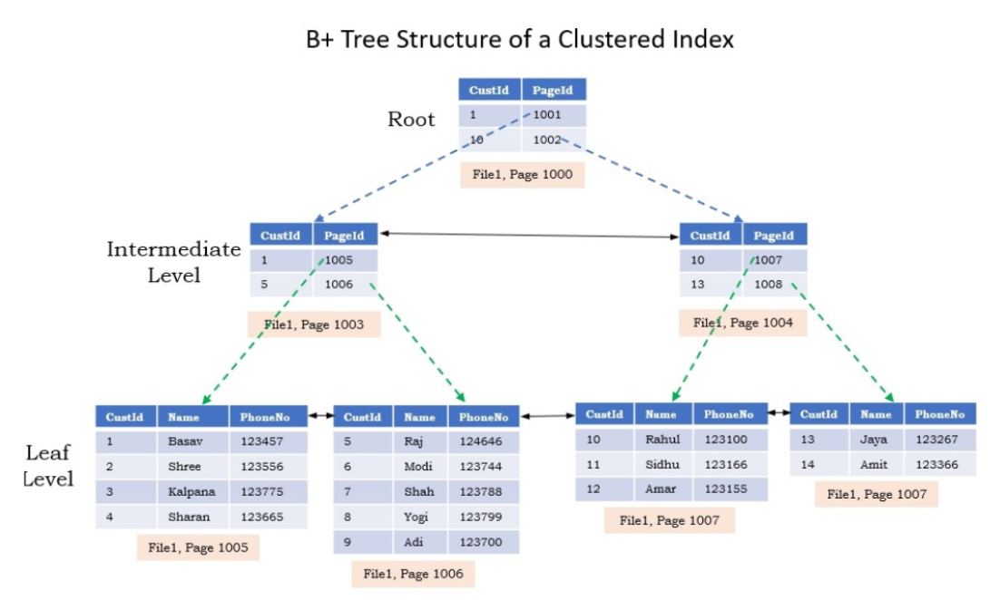
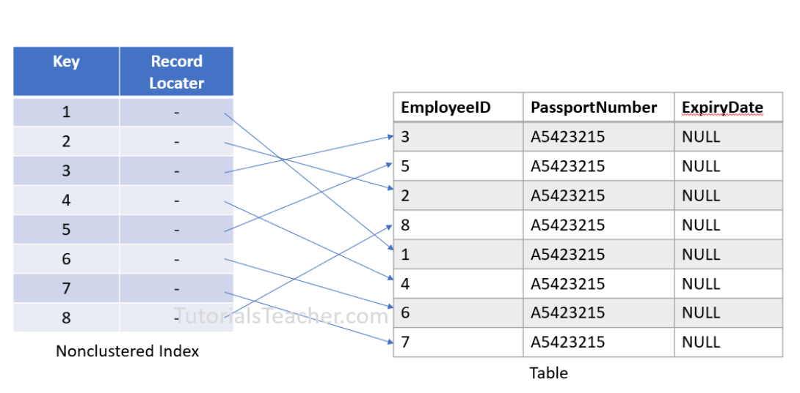
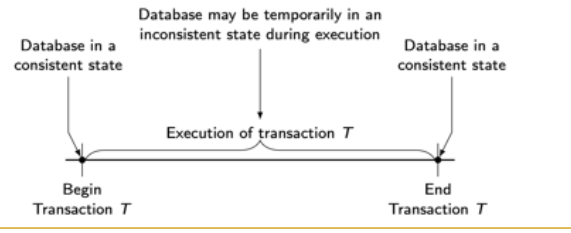

# [BUỔI 4] SQL nâng cao
## I. Tối ưu truy vấn
Tối ưu truy vấn (Query Optimization) là tập hợp các kỹ thuật và phương pháp nhằm giảm thời gian thực thi và tài nguyên sử dụng của các truy vấn SQL.

Mục tiêu chính:
- Giảm thời gian phản hồi (latency) và tăng khả năng xử lý throughput.
- Giảm tải I/O, CPU và bộ nhớ trên máy chủ cơ sở dữ liệu.
- Đảm bảo truy vấn mở rộng tốt khi dữ liệu tăng trưởng.

Các bước tiếp cận tổng quát:
1. Hiểu yêu cầu nghiệp vụ — xác định dữ liệu thực sự cần trả về và tần suất truy vấn.
2. Đo lường hiện trạng — thu thập execution plan (EXPLAIN/EXPLAIN ANALYZE), thống kê thời gian, I/O, và lock contention.
3. Áp dụng tối ưu hóa: sửa truy vấn, thêm index, điều chỉnh cấu trúc bảng, hoặc thay đổi thiết kế kiến trúc (caching, denormalization).
4. Kiểm tra lại bằng execution plan và benchmark.

Kỹ thuật tối ưu truy vấn thường dùng:
- Sử dụng EXPLAIN / EXPLAIN ANALYZE để xem kế hoạch thực thi và chi phí.
- Tránh SELECT * — chỉ chọn cột cần thiết.
- Hạn chế truy vấn trả về nhiều dòng không cần thiết bằng WHERE, LIMIT.
- Viết lại JOINs hợp lý: tránh CROSS JOIN vô ý; chọn JOIN order/kiểu phù hợp.
- Dùng chỉ mục (index) phù hợp: single-column, composite, covering index.
- Tối ưu điều kiện WHERE: tránh các hàm trên cột (ví dụ WHERE YEAR(date) = 2023) vì sẽ phá vỡ việc dùng index; thay bằng điều kiện phạm vi.
- Sử dụng phân trang hiệu quả: prefer keyset pagination (WHERE id > last_id LIMIT n) hơn offset-based pagination để tránh quét lớn.
- Sử dụng vật liệu hóa (materialized views) hoặc caching cho các truy vấn phức tạp, tần suất cao.
- Chia nhỏ truy vấn lớn (batching) khi xử lý khối lượng dữ liệu lớn.
- Tối ưu aggregate: dùng pre-aggregated tables hoặc partial aggregation khi cần.
- Sử dụng hint (nếu DBMS hỗ trợ) khi optimizer chọn kế hoạch kém.

Index và ảnh hưởng đến truy vấn:
- Index giúp tìm hàng nhanh hơn nhưng tăng chi phí ghi (INSERT/UPDATE/DELETE) và tiêu tốn không gian.
- Chọn cột để index dựa trên: tính chọn lọc (selectivity), tần suất sử dụng trong WHERE/ORDER BY/GROUP BY/ JOIN.
- Composite index: đặt thứ tự cột đúng với pattern truy vấn (ví dụ WHERE a = ? AND b = ?; hoặc ORDER BY a, b).
- Covering index: index chứa tất cả cột cần thiết cho truy vấn — có thể tránh truy cập bảng.

Ví dụ minh hoạ (MySQL/Postgres style):
- Xấu: SELECT * FROM orders WHERE YEAR(created_at) = 2024;
- Tốt: SELECT id, total, created_at FROM orders WHERE created_at >= '2024-01-01' AND created_at < '2025-01-01';

Checklist tối ưu nhanh (quick wins):
1. Thêm LIMIT nếu chỉ cần vài hàng.
2. Thay SELECT * bằng danh sách cột.
3. Kiểm tra EXPLAIN và tìm Full Table Scan (FTS) — cân nhắc index.
4. Kiểm tra cardinality và statistics của bảng (ANALYZE/UPDATE STATISTICS).
5. Kiểm tra chi phí JOIN — liệu có thể giảm kích thước bằng WHERE trước khi JOIN không.
6. Dùng connection pooling và cache ở ứng dụng nếu thích hợp.

Một vài edge-case và lưu ý:
- Không quá index hóa: mỗi index thêm chi phí ghi và làm chậm cập nhật thống kê.
- Khi dữ liệu phân phối rất không đều, selectivity thấp của cột sẽ khiến index kém hiệu quả.
- Optimizer khác nhau giữa các DBMS; luôn kiểm thử trên môi trường giống production khi có thể.

## II. Sử dụng index
- Index là cấu trúc dữ liệu đặc biệt được liên kết với các bảng hoặc Views giúp tăng tốc độ truy vấn.
- Phân loại:
    - Clustered index: Tổ chức dữ liệu bằng cách sử dụng một cây có cấu trúc đặc biệt được gọi là B-tree (Balance Tree) cho phép tìm kiếm, chèn, cập nhật, xóa theo thời gian phân bổ logarit.
    - Non-Clustered index : Tổ chức và lưu trữ dữ liệu riêng biệt với các hàng có trong bảng. Nó là một bản sao của các cột dữ liệu đã chọn từ một bảng với các liên kết đến bảng được liên kết.
- Khi nào nên sử dụng index: 
    - Chỉ nên sử dụng index khi cần search thông tin theo cột đó.
- Khi nào không nên sử dụng index: 
    - Không nên sử dụng trong các bảng nhỏ, ít bản ghi.
    - Không nên sử dụng index cho các cột thường xuyên bị sửa đổi, update dữ liệu.

> [!NOTE]
> Ở phần Intermediate Level là Page 1001 và 1002, Leaf Level cuối là 1008.
> Giải thích:
> Ở Root: Nếu CustId < 10 thì sang Page 1001, nếu >= 10 thì sang Page 1002
> Ở Intermediate: 
> - Page 1001: Nếu CustId < 5 thì sang Page 1005, nếu CustId > 5 thì đi sang Page 1006
> Tương tự...



`Cú pháp`
**Tạo Index**
```sql
CREATE INDEX index_name
ON table_name (column1, column2, ...);
```
**Đổi tên Index**
```sql
EXEC sp_rename 
    index_name, 
    new_index_name, 
    N'INDEX'; 
```

```sql
EXEC sp_rename 
    @objname = N'index_name', 
    @newname = N'new_index_name',   
    @objtype = N'INDEX';
```

**Xóa Index**
```sql
DROP INDEX table_name.index_name;
```

**Vô hiệu hóa 1 Index**: Trình tối ưu hóa truy vấn sẽ không xem xét chỉ mục vô hiệu hóa đó để tạo kế hoạch thực thi truy vấn.
```sql
ALTER INDEX index_name ON table_name DISABLE;
```

**Vô hiệu hóa tất cả Index của một bảng**
```sql
ALTER INDEX ALL ON table_name DISABLE;
```

**Bỏ vô hiệu hóa Index**
```sql
ALTER INDEX index_name ON table_name REBUILD;
```
```sql
-- Xóa chỉ mục cũ nếu tồn tại và tạo chỉ mục mới cho cột
CREATE INDEX index_name ON table_name(column_list) WITH(DROP_EXISTING=ON)
```
```sql
ALTER INDEX ALL ON table_name REBUILD;
```
### 2.2. Table Scan
- Table Scan xảy ra khi SQL Server phải đọc toàn bộ dữ liệu trong bảng để lấy kết quả, tức là quét từng dòng một trong bảng.
- Thường xảy ra khi bảng không có clustered index hoặc khi query không thể dùng được bất kỳ index nào.
- Performance thấp nhất

`Ví dụ`
Giả sử có bảng Employees không có clustered index:
```sql
SELECT * FROM Employees WHERE LastName = 'Nguyen';
```
Nếu bảng không có index nào trên cột LastName, SQL Server sẽ phải quét toàn bộ bảng để tìm các dòng có LastName = 'Nguyen' → Table Scan.
### 2.3. Index Scan
- Index Scan xảy ra khi SQL Server quét toàn bộ index để tìm dữ liệu thỏa điều kiện.
- Khác với Table Scan là dữ liệu được lưu theo cấu trúc index, nên đọc nhanh hơn nhưng vẫn quét toàn bộ index.
- Thường xảy ra khi mệnh đề WHERE không đủ cụ thể để lọc nhanh hay khi query lấy dữ liệu với phạm vi lớn.

`Ví dụ`
Giả sử bảng Employees có clustered index trên EmployeeID, và có non-clustered index trên cột LastName. Query:
```sql
SELECT * FROM Employees WHERE LastName LIKE 'N%';
```
Nếu điều kiện trả về nhiều dòng và không thể dùng Index Seek để lọc chính xác, SQL Server sẽ quét toàn bộ index LastName → Index Scan.


### 2.4. Index Seek
- Index Seek là thao tác truy vấn dữ liệu hiệu quả nhất khi SQL Server tận dụng cấu trúc B-tree của index để tìm kiếm trực tiếp các dòng thỏa điều kiện WHERE.
- Chỉ quét đúng những phần của index cần thiết, không phải toàn bộ index hay bảng.
- Thường xảy ra khi điều kiện WHERE sử dụng các giá trị cụ thể (ví dụ = hoặc BETWEEN) và index có thể dùng để lọc chính xác.

`Ví dụ`
Vẫn dùng bảng Employees có clustered index trên EmployeeID và non-clustered index trên LastName.
```sql
SELECT * FROM Employees WHERE LastName = 'Nguyen';
```
Với điều kiện cụ thể và index trên LastName, SQL Server sẽ tìm trực tiếp vị trí các dòng có LastName = 'Nguyen' trên index → Index Seek.

## III. Khái niệm Transaction, ACID, dirty read, dirty write
### 1. Transaction là gì?
- Transaction là một tập hợp các hành động được thực thi như một đơn vị duy nhất, nhằm chuyển hệ thống từ trạng thái nhất quán này sang trạng thái nhất quán khác mà không làm mất tính toàn vẹn dữ liệu.


**Begin Transaction T**: Transaction bắt đầu khi hệ thống đang ở một trạng thái nhất quán.
**Execution of Transaction T**: Trong quá trình thực hiện, có thể xảy ra trạng thái không nhất quán tạm thời (ví dụ: đã trừ tiền tài khoản A nhưng chưa cộng vào B).
**End Transaction T**: 
- **Commit**: Nếu mọi hành động trong transaction đều thực hiện thành công → Hệ thống chuyển sang trạng thái nhất quán mới.
- **Rollback**: Nếu có lỗi xảy ra (hệ thống, logic, dữ liệu...) → Toàn bộ các hành động của transaction bị hủy bỏ, và hệ thống quay lại trạng thái nhất quán ban đầu trước khi transaction bắt đầu.

### 2. Tính chất của Transaction (ACID)
- **Atomicity(Tính nguyên tử)**: 
    - Transaction được xem như một đơn vị không thể chia nhỏ.
    - Transaction phải được thực hiện trọn vẹn hoặc không thực hiện gì cả.
    - Nếu một phần của transaction bị lỗi (ví dụ mất điện, lỗi logic...), toàn bộ transaction sẽ bị huỷ và rollback.
    Ví dụ: Chuyển tiền - nếu trừ tiền từ tài khoản A thành công nhưng cộng vào B bị lỗi, thì hệ thống phải rollback việc trừ tiền từ A.

    ```sql
    BEGIN TRANSACTION;

    -- Trừ 1000 từ tài khoản A
    UPDATE Accounts SET Balance = Balance - 1000 WHERE AccountID = 'A';

    -- Nếu lỗi xảy ra ở bước này, ví dụ account B không tồn tại
    UPDATE Accounts SET Balance = Balance + 1000 WHERE AccountID = 'B';

    -- Nếu lỗi xảy ra, rollback
    IF @@ERROR != 0
    BEGIN
        ROLLBACK TRANSACTION;
        PRINT 'Transaction bị hủy, rollback.';
        RETURN;
    END

    COMMIT TRANSACTION;
    PRINT 'Transaction thành công.';
    ```

- **Consistency(Tính nhất quán)**:
    - Transaction phải biến hệ thống từ một trạng thái hợp lệ sang một trạng thái hợp lệ khác, không vi phạm các ràng buộc toàn vẹn.
    - Nếu dữ liệu có ràng buộc như “giá trị không âm”, “FK IS NOT NULL”… thì sau khi transaction xong, các ràng buộc vẫn phải đúng.
    Ví dụ: Tổng số tiền trong ngân hàng phải không đổi nếu chỉ có chuyển khoản giữa tài khoản A và B.
    ```sql
    BEGIN TRANSACTION;

    -- Lấy tổng trước khi chuyển khoản
    DECLARE @TotalBefore MONEY;
    SELECT @TotalBefore = SUM(Balance) FROM Accounts;

    -- Trừ tiền tài khoản A
    UPDATE Accounts
    SET Balance = Balance - 1000
    WHERE AccountID = 'A';

    -- Cộng tiền tài khoản B
    UPDATE Accounts
    SET Balance = Balance + 1000
    WHERE AccountID = 'B';

    -- Lấy tổng số dư sau khi chuyển khoản
    DECLARE @TotalAfter MONEY;
    SELECT @TotalAfter = SUM(Balance) FROM Accounts;

    -- Kiểm tra tổng số dư có thay đổi không
    IF @TotalBefore != @TotalAfter
    BEGIN
        ROLLBACK TRANSACTION;
        PRINT 'Consistency vi phạm: tổng số dư thay đổi, rollback transaction.';
    END
    ELSE
    BEGIN
        COMMIT TRANSACTION;
        PRINT 'Transaction thành công, consistency được đảm bảo.';
    END
    ```
- **Isolation(Tính cô lập)**:
    - Khi nhiều transaction cùng chạy, chúng không được làm ảnh hưởng đến nhau.
    - Một transaction đang chạy sẽ không nhìn thấy thay đổi tạm thời của transaction khác.
    - Hiệu ứng của các transaction đồng thời phải giống như chúng được thực hiện tuần tự  - dù thực tế chạy song song để tối ưu hiệu suất.
    Ví dụ: Tài khoản của B có 1tr. B đăng nhập vào app. A chuyển cho B 3tr. Sau đó B cũng chỉ rút được tối đa 1tr vì tại phiên đăng nhập đó độc lập không liên quan với transaction A chuyển tiền cho B.
    **Transaction B: Phiên đăng nhập của người nhận (đọc số dư tài khoản)**
    ```sql
    -- Đặt mức độ cô lập READ COMMITTED (default trong SQL Server)
    SET TRANSACTION ISOLATION LEVEL READ COMMITTED;
    BEGIN TRANSACTION;

    -- B đọc số dư tài khoản (ví dụ là 1 triệu)
    SELECT Balance FROM Accounts WHERE AccountID = 'B';

    -- Giữ transaction mở (ví dụ đang dùng app)
    WAITFOR DELAY '00:01:00'; -- thời gian chờ (60 giây)

    COMMIT TRANSACTION;
    ```
    **Transaction A: Chuyển tiền cho B (chạy song song)**
    ```sql
    BEGIN TRANSACTION;

    -- Trừ tiền tài khoản A
    UPDATE Accounts SET Balance = Balance - 3000000 WHERE AccountID = 'A';

    -- Cộng tiền tài khoản B
    UPDATE Accounts SET Balance = Balance + 3000000 WHERE AccountID = 'B';

    COMMIT TRANSACTION;
    ```
    Giải thích:
    > Khi B đã bắt đầu transaction và đọc số dư (1 triệu) trong phiên đăng nhập, transaction A chuyển 3 triệu cho B và commit ngay sau đó.
    > Tuy nhiên, vì transaction B đang chạy ở mức isolation READ COMMITTED, nên khi B đọc số dư trong transaction, nó chỉ nhìn thấy dữ liệu đã commit trước đó (1 triệu), không nhìn thấy số dư mới 4 triệu vừa được commit của A nếu transaction B chưa đọc lại dữ liệu.
    > Do đó, trong phiên làm việc đó, B vẫn chỉ có thể rút tối đa 1 triệu (số dư lúc bắt đầu phiên), đảm bảo transaction cô lập không bị ảnh hưởng bởi thay đổi của transaction khác chạy đồng thời.
- **Durability (Tính bền vững)**:
    - Khi một transaction đã commit thành công, thì mọi thay đổi phải được lưu vĩnh viễn, dù có sự cố hệ thống xảy ra ngay sau đó.
    Ví dụ: Bạn rút tiền ATM xong, dù ATM mất điện ngay sau đó, tài khoản vẫn bị trừ đúng số tiền.

    ```sql
    BEGIN TRANSACTION;

    UPDATE Accounts
    SET Balance = Balance - 500000
    WHERE AccountID = 'User123';

    COMMIT TRANSACTION;
    ```
    > Nếu không có tính durability, thì có thể xảy ra trường hợp: rút tiền thành công trên màn hình, nhưng do sự cố mất điện, dữ liệu không được lưu lại → tiền không bị trừ thật, gây mất đồng bộ.

Tóm tắt:
|Tính chất|Ý nghĩa|Mục đích|
|---|---|---|
|Atomicity|Hoặc tất cả, hoặc không gì cả|Không có trạng thái nửa vời|
|Consistency|Trạng thái trước/sau đều hợp lệ |Không làm “sai” dữ liệu|
|Isolation|Không bị ảnh hưởng bởi transation khác|Tránh xung đột, rối loạn|
|Durability |Thay đổi là vĩnh viễn|Không mất dữ liệu đã xác nhận|