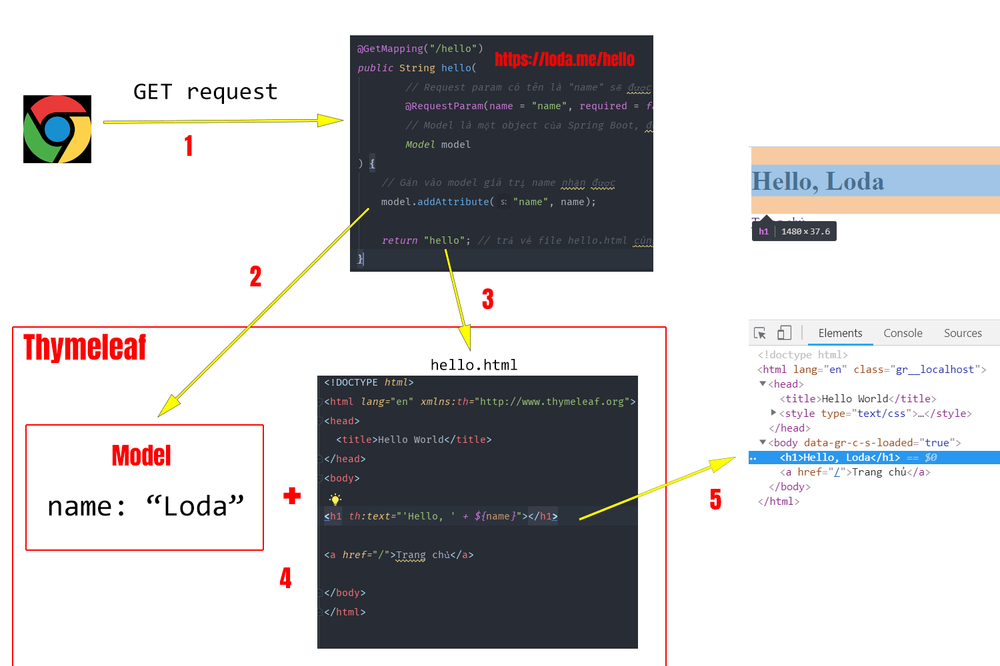

# Buổi 2: SPRING MVC
## I. Khởi tạo dự án SpringBoot

## II. Bean trong SpringBoot: Bean là gì, BeanFactory là gì, vòng đời của 1 Bean ở trong SpringBoot
### Bean là gì?
**Định nghĩa**:
- Trong mô hình của Spring Framework, Bean là các đối tượng mà IoC Container quản lý. Chúng là những thành phần cốt lõi được sử dụng để xây dựng ứng dụng. Bất kỳ đối tượng nào được khởi tạo, lắp ráp và quản lý bởi Spring IoC Container đều được gọi là Bean. Container này xử lý việc tạo ra và quản lý các Bean, bao gồm cả vòng đời của chúng từ khởi tạo đến hủy bỏ.
### Tạo Bean như thế nào?
- Trong SpringBoot, việc tạo Bean có thể ví như việc đặt các món đồ trong nhà bạn. Mỗi món đồ (hay Bean) có một mục đích và cách sử dụng riêng. SpringBoot cung cấp nhiều cách để bạn “đặt món đồ này vào nhà”, hay nói cách khác, tạo Bean. Dưới đây là hai phương pháp phổ biến nhất để bạn có thể tạo Bean trong ứng dụng của mình:

#### Sử dụng các Annotation Đánh Dấu Lên Class
- Khi bạn muốn Spring tự động nhận biết và quản lý một Bean, bạn có thể sử dụng các annotation như `@Component`, `@Service`, `@Repository`, và `@Controller`. Mỗi annotation này có một ý nghĩa riêng, phù hợp với loại “món đồ” mà bạn muốn đặt trong “ngôi nhà” của mình.
    - `@Component`: Đây là cách chung nhất để đánh dấu một Bean. Nó cho biết đây là một đối tượng của ứng dụng mà bạn muốn Spring quản lý.
    - `@Service`: Dùng cho các lớp thực hiện xử lý logic nghiệp vụ.
    - `@Repository`: Sử dụng cho các lớp làm việc trực tiếp với cơ sở dữ liệu.
    - `@Controller`: Đặc biệt dành cho các lớp xử lý các yêu cầu HTTP, đóng vai trò như một cầu nối giữa người dùng và ứng dụng của bạn.
- Ví dụ:
```java
@Service
public class BookService {
    // Logic nghiệp vụ để quản lý sách
}
```
#### Sử dụng @Bean Đánh Dấu Lên Method
- Phương pháp thứ hai là định nghĩa Bean trong một lớp Java với annotation `@Configuration`. Đây là cách tạo Bean một cách rõ ràng hơn, thường được sử dụng khi bạn cần cấu hình chi tiết hơn hoặc tạo Bean theo điều kiện đặc biệt.

- Trong lớp `@Configuration`, bạn sẽ định nghĩa các phương thức trả về đối tượng của Bean, và mỗi phương thức này được đánh dấu bằng `@Bean`. Điều này cho Spring biết rằng mỗi đối tượng trả về từ phương thức là một Bean và nên được quản lý bởi IoC Container.

- Ví dụ:
```java
@Configuration
public class AppConfig {
    @Bean
    public BookService bookService() {
        return new BookService();
    }
}
```
- Trong ví dụ này, bookService là một Bean được tạo ra và quản lý bởi Spring. Khi ứng dụng của bạn chạy, Spring sẽ tìm trong các lớp `@Configuration để tạo và cấu hình các Bean theo định nghĩa.

- Mỗi cách trên có ưu điểm riêng và tùy thuộc vào nhu cầu cụ thể của ứng dụng bạn đang xây dựng, bạn có thể lựa chọn cách thức phù hợp để “đặt món đồ” vào “ngôi nhà” của mình. Việc lựa chọn đúng cách không chỉ giúp ứng dụng của bạn chạy trơn tru mà còn dễ dàng bảo trì và mở rộng trong tương lai.
### BeanFactory là gì?

**Định nghĩa:**
- `BeanFactory` là interface cơ bản nhất trong Spring IoC container. Nó định nghĩa cách mà container quản lý và cung cấp các bean (đối tượng) — bao gồm việc lưu trữ mô tả bean, tạo thể hiện của bean, và cấp phát bean theo yêu cầu (dependency injection).

**Vai trò chính:**
- Quản lý vòng đời cơ bản của bean: lưu trữ định nghĩa bean, khởi tạo (instantiate) và cung cấp bean khi gọi `getBean(...)`.
- Hỗ trợ các scope cơ bản như `singleton` và `prototype`.
- Hỗ trợ injection các phụ thuộc giữa các bean (constructor/setter injection).

**Một số đặc điểm kỹ thuật:**
- `BeanFactory` thực hiện lazy-loading mặc định — nghĩa là nó chỉ khởi tạo bean khi có yêu cầu (khi gọi `getBean`).
- `BeanFactory` là thành phần mức thấp, nhẹ hơn và có ít tính năng hơn so với `ApplicationContext`.

**So sánh với ApplicationContext:**
- `ApplicationContext` là một mở rộng của `BeanFactory` (implements `BeanFactory`) và cung cấp thêm nhiều tính năng "enterprise" như:
    - Tự động đăng ký và chạy `BeanPostProcessor` và `BeanFactoryPostProcessor`.
    - Hỗ trợ event publishing (sự kiện ứng dụng), i18n (MessageSource), và resource loading (tải tài nguyên từ classpath/file system).
    - Thường pre-instantiate các singleton beans khi context khởi động (không lazy như BeanFactory mặc định).
- Vì vậy, trong ứng dụng Spring Boot / Spring hiện đại, bạn sẽ thường xuyên dùng `ApplicationContext` (ví dụ `AnnotationConfigApplicationContext`, `ClassPathXmlApplicationContext` hoặc Spring Boot tự cấu hình `ApplicationContext`) thay vì trực tiếp thao tác với `BeanFactory`.

**Khi nào dùng BeanFactory?**
- Dùng `BeanFactory` khi bạn cần một container rất nhẹ, muốn kiểm soát thủ công quá trình nạp bean (ví dụ trong môi trường tài nguyên hạn chế hoặc trong các kịch bản tải muộn). Nhưng trong hầu hết ứng dụng doanh nghiệp, `ApplicationContext` là lựa chọn phù hợp hơn.


**Lưu ý thực hành:**
- Với Spring Boot và ứng dụng web hiện đại, bạn hiếm khi cần tạo `BeanFactory` thủ công; thay vào đó hãy dùng cấu hình bằng annotation và để Spring Boot tự quản lý `ApplicationContext` cho bạn.
- Hiểu khác biệt lazy vs eager (BeanFactory vs ApplicationContext) hữu ích khi tinh chỉnh thời gian khởi động hoặc tiêu thụ bộ nhớ.

### Vòng đời của Bean
- Vòng đời bean (Bean Lifecycle) là quá trình mà một đối tượng (bean) được Spring IoC Container khởi tạo, quản lý và cuối cùng là hủy bỏ. Việc hiểu rõ vòng đời này là rất quan trọng để có thể can thiệp vào các giai đoạn, thực thi các logic nghiệp vụ (như khởi tạo tài nguyên, giải phóng kết nối) tại đúng thời điểm.

- Vòng đời của một bean được quản lý bởi Spring Container và có thể được chia thành ba giai đoạn chính: **Khởi tạo, Sử dụng,** và **Hủy**.

#### 1. Giai đoạn Khởi tạo (Initialization Phase)
Đây là giai đoạn phức tạp nhất, bao gồm nhiều bước, nhưng có hai bước quan trọng nhất mà lập trình viên cần quan tâm:
##### a. Khởi tạo và Tiêm phụ thuộc (Instantiation & DI)
- **Instantiation (Khởi tạo đối tượng)**: Container đọc các định nghĩa bean (từ file Java Config, Annotation, hoặc XML) và tạo ra một instance thô của bean bằng cách gọi hàm khởi tạo (constructor) của nó.

- **Populate Properties (Tiêm phụ thuộc)**: Sau khi instance được tạo, Spring Container tiến hành "tiêm" (inject) tất cả các phụ thuộc (dependencies) đã được đánh dấu (ví dụ: qua @Autowired, @Value, hoặc constructor injection) vào instance của bean.

**Lưu ý quan trọng**: Tại thời điểm này, bean đã tồn tại nhưng chưa sẵn sàng để sử dụng, vì logic khởi tạo tùy chỉnh (ví dụ: kết nối CSDL, đọc file config) có thể chưa được thực thi.

##### b. Các Callback Khởi tạo (Initialization Callbacks)
Sau khi tất cả các phụ thuộc đã được tiêm hoàn tất, Spring cung cấp các "callback" (phương thức gọi lại) để lập trình viên có thể thực thi logic khởi tạo tùy chỉnh. Đây là thời điểm an toàn để chạy các tác vụ chuẩn bị, vì chúng ta có thể chắc chắn rằng tất cả các dependency đã sẵn sàng.

Spring cung cấp hai cơ chế chính:

- **Annotation `@PostConstruct`:** Đây là phương thức được khuyến nghị. Bất kỳ phương thức public nào được đánh dấu với annotation `@PostConstruct` (chuẩn JSR-250) sẽ được Container gọi **một lần duy nhất** sau khi quá trình tiêm phụ thuộc hoàn tất.

- **Interface InitializingBean:** Bean có thể implement interface InitializingBean và viết logic khởi tạo bên trong phương thức afterPropertiesSet(). Đây là cách làm cũ, gắn kết code của bạn chặt chẽ với Spring API.

```java
// Ví dụ sử dụng @PostConstruct (khuyến nghị)
@Component
public class DatabaseConnector {

    @Autowired
    private DataSource dataSource; // Được tiêm vào trước

    @PostConstruct
    public void connect() {
        // dataSource chắc chắn đã tồn tại (không còn null)
        // Đây là nơi an toàn để thực thi logic kết nối CSDL.
        System.out.println("Đã khởi tạo bean, đang kết nối CSDL...");
    }
}
```
##### 2. Giai đoạn Sử dụng (Bean in Use)
Sau khi hoàn tất giai đoạn khởi tạo (đã chạy qua `@PostConstruct`), bean được xem là đã sẵn sàng. Nó tồn tại trong "ngăn chứa" (Application Context) và được cung cấp cho bất kỳ bean nào khác yêu cầu nó (ví dụ: khi được tiêm qua `@Autowired`).

Đối với các bean có scope là **singleton** (mặc định), chỉ có một instance duy nhất được duy trì và chia sẻ trong suốt thời gian container hoạt động.

##### 3. Giai đoạn Hủy (Destruction Phase)
Khi Spring Container bị tắt một cách có trật tự (ví dụ: khi ứng dụng đóng lại), nó sẽ quản lý việc hủy bỏ các bean mà nó đã tạo.

**a. Các Callback Hủy (Destruction Callbacks)**
Trước khi một bean bị xóa hoàn toàn khỏi bộ nhớ, Spring cung cấp các callback để cho phép bean thực thi logic dọn dẹp (cleanup). Đây là điều **bắt buộc** để giải phóng các tài nguyên quan trọng (như đóng kết nối CSDL, đóng file, ngắt kết nối mạng) nhằm tránh rò rỉ tài nguyên (resource leaks).

Tương tự như khởi tạo, có hai cơ chế chính:
- **Annotation `@PreDestroy`**: Đây là phương thức được khuyến nghị. Bất kỳ phương thức nào được đánh dấu với `@PreDestroy` (chuẩn JSR-250) sẽ được Container gọi một lần duy nhất ngay trước khi bean bị hủy.
- **Interface DisposableBean**: Bean có thể implement interface `DisposableBean` và viết logic dọn dẹp bên trong phương thức `destroy()`.

```java
// Ví dụ sử dụng @PreDestroy (khuyến nghị)
@Component
public class DatabaseConnector {

    // ... (phần khởi tạo) ...

    @PreDestroy
    public void cleanup() {
        // Đây là nơi an toàn để giải phóng tài nguyên
        System.out.println("Ứng dụng đang tắt, đóng kết nối CSDL...");
        // ... code đóng kết nối ...
    }
}
```
## III. Spring MVC : @Controller, Thymeleaf

### Controller trong Spring MVC

**Vai trò của Controller:**
- `Controller` là thành phần điều phối (controller layer) trong mô hình MVC: nhận HTTP request từ client, xử lý (gọi service, thao tác dữ liệu), chuẩn bị dữ liệu cho view (Model) hoặc trả về dữ liệu trực tiếp (JSON/Response). Controller là "cầu nối" giữa tầng giao diện (View) và tầng nghiệp vụ (Service/Repository).

**@Controller vs @RestController:**
- `@Controller`: dùng cho ứng dụng trả về view (ví dụ Thymeleaf). Các handler method thường trả về `String` (tên view) hoặc `ModelAndView`, và dữ liệu đưa vào `Model` để hiển thị.
- `@RestController`: tương đương `@Controller` + `@ResponseBody`. Dùng cho REST API — phương thức trả trực tiếp đối tượng (Jackson sẽ serialize thành JSON) hoặc `ResponseEntity`.

**Mapping request:**
- `@RequestMapping` (class/method) định nghĩa URL và HTTP method (GET, POST...). Các shortcut: `@GetMapping`, `@PostMapping`, `@PutMapping`, `@DeleteMapping`, `@PatchMapping`.

Ví dụ:
```java
@Controller
@RequestMapping("/books")
public class BookController {

  @GetMapping("/{id}")
  public String getBook(@PathVariable Long id, Model model) {
    Book b = bookService.findById(id);
    model.addAttribute("book", b);
    return "book/detail"; // trả về view name (Thymeleaf template)
  }
}
```

**Tham số handler phổ biến:**
- `@RequestParam` — lấy query param hoặc form field
- `@PathVariable` — lấy biến trên đường dẫn
- `@ModelAttribute` — binding form data vào object và đưa object vào Model
- `@RequestBody` — bind request body (JSON) vào object (thường dùng trong REST)
- `@RequestHeader`, `@CookieValue`, `HttpServletRequest`, `HttpSession` — lấy các thông tin ngữ cảnh khác

Ví dụ form binding với `@ModelAttribute`:
```java
@PostMapping("/books")
public String create(@ModelAttribute("bookForm") BookForm form, BindingResult result, Model model) {
  if (result.hasErrors()) {
    return "book/form"; // show lại form khi có lỗi
  }
  bookService.create(form);
  return "redirect:/books"; // PRG pattern
}
```

**Validation:**
- Dùng `@Valid` (JSR-303) trên parameter kết hợp `BindingResult` để kiểm tra lỗi validate.
- Hiện thị lỗi trong view bằng cách đọc `BindingResult` hoặc dùng Thymeleaf helpers.

```java
@PostMapping("/users")
public String saveUser(@Valid @ModelAttribute UserDto dto, BindingResult br) {
  if (br.hasErrors()) return "user/form";
  userService.save(dto);
  return "redirect:/users";
}
```

**Trả về từ handler:**
- `String` — tên view (ví dụ "users/list") khi dùng `@Controller` + Thymeleaf.
- `ModelAndView` — chứa cả model và view.
- `void` — trực tiếp viết response qua `HttpServletResponse` (ít dùng).
- `ResponseEntity<T>` / `T` với `@RestController` — trả JSON/HTTP status.

**Redirect / Forward:**
- `return "redirect:/path";` — redirect client (PRG pattern sau POST).
- `return "forward:/path";` — server forward nội bộ.

**Session & Flash Attributes:**
- `@SessionAttributes("cart")` để giữ attribute trong session cho controller cụ thể.
- `RedirectAttributes.addFlashAttribute(...)` để gửi dữ liệu tạm khi redirect.

**Binding customization:**
- `@InitBinder` để đăng ký binder/formatter, ví dụ parse ngày, trim strings.

**Exception handling trong Controller:**
- Cục bộ: `@ExceptionHandler` trong controller xử lý exception riêng cho controller đó.
- Toàn cục: `@ControllerAdvice` + `@ExceptionHandler` để xử lý cho nhiều controller.

**Integration với Thymeleaf:**
- Controller chuẩn bị dữ liệu trong `Model` (key-value). Thymeleaf dùng `${...}` hoặc `*{...}` để truy xuất.
- Trả `return "template/name"` để render `src/main/resources/templates/template/name.html`.

**Best-practices:**
- Tách biệt: Controller chỉ điều phối và chuẩn bị Model; logic nghiệp vụ nằm trong Service.
- Tránh trả thực thi business logic trong handler.
- Dùng PRG (Post/Redirect/Get) để tránh submit lại form khi refresh.
- Dùng DTO/Form object cho binding, tránh lộ entity domain trực tiếp vào View.

**Ví dụ đầy đủ (Controller + Thymeleaf flow):**
```java
@Controller
public class ContactController {

  @GetMapping("/contact")
  public String form(Model model) {
    model.addAttribute("contactForm", new ContactForm());
    return "contact/form"; // Thymeleaf template
  }

  @PostMapping("/contact")
  public String submit(@Valid @ModelAttribute("contactForm") ContactForm form,
             BindingResult br, RedirectAttributes ra) {
    if (br.hasErrors()) return "contact/form";
    contactService.send(form);
    ra.addFlashAttribute("msg", "Gửi liên hệ thành công");
    return "redirect:/contact";
  }
}
```

Phần `Thymeleaf` bên dưới sẽ minh hoạ cách lấy `contactForm` và hiển thị lỗi validate.

### Thymeleaf
- Thymeleaf là một Java Template Engine. Có nhiệm vụ xử lý và generate ra các file HTML, XML, v.v..
- Các file HMTL do Thymeleaf tạo ra là nhờ kết hợp dữ liệu và template + quy tắc để sinh ra một file HTML chứa đầy đủ thông tin.

Việc của bạn là cung cấp dữ liệu và quy định template như nào, còn việc dùng các thông tin đó để render ra HTML sẽ do Thymeleaf giải quyết.
#### Cú pháp
- Cú pháp của Thymeleaf sẽ là một attributes (Thuộc tính) của thẻ HTML và bắt đầu bằng chữ th:.
- Với cách tiếp cận này, bạn sẽ chỉ cần sử dụng các thẻ HTML cơ bản đã biết mà không cần bổ sung thêm syntax hay thẻ mới như JSP truyền thống.
- Ví dụ: Để truyền dữ liệu từ biến name trong Java vào một thẻ H1 của HTML.
```xml
<h1 th:text="${name}"></h1>
```
`th:text="${name}"` để Thymeleaf lấy thông tin từ biến `name` và đưa vào thẻ `H1`. Kết quả khi render ra:
```xml
// Giả sử String name = "loda"
<h1>Loda</h1>
```
Chào bạn, đây là nội dung bạn cung cấp đã được biên soạn lại và trình bày dưới dạng Markdown cho rõ ràng, ngắn gọn và dễ hiểu hơn.

#### Model trong Spring Boot

Trong Spring Boot, **`Model`** là một đối tượng Java dùng để chứa dữ liệu và chuyển dữ liệu đó từ **Controller** sang **View** (template).
  * Nó hoạt động như một cầu nối, cho phép tầng logic (Controller) gửi thông tin cho tầng trình bày (View).
  * Dữ liệu được lưu trong `Model` dưới dạng **key-value**.
  * Khi sử dụng với Thymeleaf, `Model` chính là **`Context`** mà template engine dùng để render ra trang HTML cuối cùng.

**Ví dụ trong Controller:**
Chúng ta thêm một thuộc tính tên `today` với giá trị là `"Monday"` vào `Model`.

```java
// Trong phương thức của Controller
model.addAttribute("today", "Monday");
```

#### Các Biểu thức Chuẩn của Thymeleaf

Để truy xuất và hiển thị dữ liệu từ `Model` (hoặc `Context`) trong file HTML, Thymeleaf cung cấp các biểu thức chuẩn.

##### 1\. Biểu thức Biến: `${...}`

Đây là biểu thức cơ bản nhất, dùng để lấy giá trị của một biến **bất kỳ** (biến toàn cục) có trong `Model`.

  * **Controller:** `model.addAttribute("today", "Monday");`
  * **View (HTML):**
    ```html
    <p>Hôm nay là: <span th:text="${today}"></span>.</p>
    ```
  * **Kết quả:** `<p>Hôm nay là: <span>Monday</span>.</p>`

##### 2\. Biểu thức Chọn: `*{...}`

Biểu thức này (còn gọi là *asterisk syntax*) cũng dùng để lấy giá trị của biến, nhưng nó lấy thuộc tính từ một **đối tượng đã được chọn** thông qua `th:object`.

Điều này rất hữu ích khi làm việc với các đối tượng phức tạp hoặc các form, giúp code sạch sẽ hơn.

  * **View (HTML):**
    ```html
    <div th:object="${session.user}">
      <p>Tên: <span th:text="*{firstName}"></span>.</p> 
      <p>Họ: <span th:text="*{lastName}"></span>.</p>
    </div>
    ```
  * **Tương đương với cách dùng `${...}`:**
    ```html
    <div>
      <p>Tên: <span th:text="${session.user.firstName}"></span>.</p>
      <p>Họ: <span th:text="${session.user.lastName}"></span>.</p>
    </div>
    ```

##### 3\. Biểu thức Thông điệp: `#{...}`

Dùng để lấy các **thông điệp (message)** từ các file cấu hình (ví dụ: `messages.properties`), thường được sử dụng cho việc **đa ngôn ngữ (i18n)**.

  * **File `messages.properties`:**
    ```properties
    home.welcome=Chào mừng đến với cửa hàng!
    ```
  * **View (HTML):**
    ```html
    <p th:utext="#{home.welcome}">Xin chào</p>
    ```
  * **Kết quả:** `<p>Chào mừng đến với cửa hàng!</p>`

##### 4\. Biểu thức URL: `@{...}`

Đây là cách chuẩn và an toàn để **tạo đường dẫn URL (link)** trong Thymeleaf. Nó tự động xử lý **context path** của server và cho phép bạn chèn các tham số động một cách dễ dàng.

  * **Ví dụ 1: URL tương đối với tham số (Query Param)**

    ```html
    <a th:href="@{/order/details(orderId=${o.id})}">Xem</a>
    ```

  * **Ví dụ 2: URL với biến đường dẫn (Path Variable)**

    ```html
    <a th:href="@{/order/{orderId}/details(orderId=${o.id})}">Xem</a>
    ```

  * **Ví dụ 3: URL tuyệt đối**

    ```html
    <a th:href="@{http://example.com/order/details(orderId=${o.id})}">Xem</a>
    ```
## IV. 1 số Annotation trong SpingBoot: @SpringBootApplication, @Component, @Bean, @Autowired

### @SpringBootApplication
Chúng ta sử dụng annotation này cho Main class của một ứng dụng Spring Boot. 
```java
@SpringBootApplication
class MainApplication {
    public static void main(String[] args) {
        SpringApplication.run(MainApplication.class, args);
    }
}
```
- `@SpringBootApplication` đóng gói 3 annotation `@Configuration`, `@EnableAutoConfiguration` và `@ComponentScan` bên trong. Vì vậy, đừng có sử dụng `@SpringBootApplication` với một trong 3 annotation trên nhé, ngố lắm.
### @Component

- Định nghĩa: `@Component` là một annotation *stereotype* dùng để đánh dấu một lớp Java như một Spring-managed bean. Khi Spring scan package (component-scan), các lớp được đánh dấu `@Component` (và các chuyên biệt của nó như `@Service`, `@Repository`, `@Controller`) sẽ được đăng ký vào `ApplicationContext`.

- Hành vi chính:
  - Tự động được phát hiện bởi component scanning (nếu package chứa class nằm trong phạm vi scan).
  - Tên bean mặc định là tên class với chữ cái đầu viết thường (ví dụ `bookService` cho `BookService`), hoặc bạn có thể chỉ định tên rõ ràng: `@Component("myBeanName")`.
  - Phù hợp để đánh dấu các bean chung; với các semantics chuyên biệt, dùng `@Service` (business), `@Repository` (data access) hoặc `@Controller` (web controller).

- Ví dụ:
```java
@Component
public class BookMapper {
    public BookDto toDto(Book b) { /* ... */ }
}
```

- Lưu ý:
  - Để được phát hiện, package chứa class phải nằm trong phạm vi `@ComponentScan` (Spring Boot mặc định scan gốc package của `@SpringBootApplication`).

### @Bean

- Định nghĩa: `@Bean` dùng để khai báo một bean trong phương thức của một lớp `@Configuration`. Phương thức trả về một đối tượng sẽ được Spring quản lý như bean.

- Hành vi chính:
  - Thường dùng khi cần tạo bean bằng code (ví dụ cấu hình thư viện bên ngoài, tạo datasource, cấu hình phức tạp).
  - Bean trả về mặc định là `singleton` (mỗi method gọi lần đầu tạo một instance; Spring dùng proxy CGLIB để đảm bảo gọi nhiều lần vẫn trả về cùng một bean khi method nằm trong `@Configuration`).
  - Có thể cấu hình `initMethod`/`destroyMethod`, `@Lazy`, `@Primary`, v.v.

- Ví dụ:
```java
@Configuration
public class AppConfig {

    @Bean
    public ObjectMapper objectMapper() {
        ObjectMapper om = new ObjectMapper();
        // cấu hình custom
        return om;
    }

    @Bean(initMethod = "start", destroyMethod = "stop")
    public SomeService someService() {
        return new SomeService();
    }
}
```

- Ghi chú kỹ thuật:
  - Nếu `@Configuration` class không được proxy (ví dụ chỉ dùng `@Bean` trong class thường, không `@Configuration`), thì mỗi lần gọi method `@Bean` có thể tạo instance mới — vì vậy nên dùng `@Configuration` để Spring xử lý proxy và đảm bảo singleton theo mong muốn.
  - `@Bean` hữu ích để cấu hình bên ngoài (third-party) hoặc khi cần logic khởi tạo phức tạp.

### @Autowired

- Định nghĩa: `@Autowired` là annotation của Spring để yêu cầu IoC container tự động inject một bean phù hợp vào một điểm injection (constructor, setter hoặc field).

- Các kiểu injection:
  - Constructor injection (được khuyến nghị): an toàn, dễ test và làm rõ dependencies.
    ```java
    @Service
    public class OrderService {
        private final PaymentClient payment;

        public OrderService(PaymentClient payment) { // Spring sẽ inject tự động
            this.payment = payment;
        }
    }
    ```
    (Kể từ Spring 4.3, nếu class chỉ có một constructor, `@Autowired` có thể bỏ qua.)

  - Setter injection:
    ```java
    @Component
    public class A {
        private B b;

        @Autowired
        public void setB(B b) { this.b = b; }
    }
    ```

  - Field injection (ít khuyến nghị vì khó test):
    ```java
    @Component
    public class C {
        @Autowired
        private D d; // không tốt cho test
    }
    ```

- Lựa chọn bean khi có nhiều bean cùng type:
  - `@Qualifier("beanName")` để chỉ rõ tên bean.
  - `@Primary` trên một bean để ưu tiên.

```java
@Component("fastPayment")
public class FastPayment implements PaymentClient {}

@Component("slowPayment")
public class SlowPayment implements PaymentClient {}

@Service
public class PaymentService {
    public PaymentService(@Qualifier("fastPayment") PaymentClient client) { ... }
}
```
## V. Lombok: @Getter, @Setter, @ToString, @Data, @Builder, @Constructior
- Project Lombok là một công cụ giúp chúng ta generate code một cách tự động nhưng không phải giống như các IDE làm cho chúng ta. Các IDE generate các phương thức Getter, Setter và một số phương thức khác trong các tập tin .java. Project Lombok cũng generate các phương thức đó nhưng là trong các tập tin .class file.
- Tất cả công việc chúng ta cần làm chỉ là sử dụng một số annotation của Project Lombok như @Getter, @Setter, @Builder, …  việc còn lại Project Lombok sẽ làm cho chúng ta. Tất nhiên, những thứ các bạn không muốn làm tự động thì bạn cũng có thể chỉ định để Project Lombok không generate chúng.

### @Getter, @Setter
- Ví dụ:
1. Khi KHÔNG dùng Lombok (Cách truyền thống)
Bạn phải tự tay viết tất cả các phương thức get và set cho từng trường.

```java
// File: User.java

public class User {

    private String name;
    private int age;

    // --- Bạn phải tự viết tất cả những thứ này ---

    // Getter cho name
    public String getName() {
        return this.name;
    }

    // Setter cho name
    public void setName(String name) {
        this.name = name;
    }

    // Getter cho age
    public int getAge() {
        return this.age;
    }

    // Setter cho age
    public void setAge(int age) {
        this.age = age;
    }
}
```
=> Vấn đề: File User.java của bạn trở nên rất dài và "rác", mặc dù logic của nó rất đơn giản.

2. Khi có dùng Lombok
Bây giờ, bạn chỉ cần dán nhãn @Getter và @Setter lên trên class. Bạn không cần viết bất kỳ phương thức nào cả.

```java
// File: User.java

import lombok.Getter;
import lombok.Setter;

@Getter // <-- Lombok tự động tạo TẤT CẢ các hàm get
@Setter // <-- Lombok tự động tạo TẤT CẢ các hàm set
public class User {

    private String name;
    private int age;

    // --- Hoàn toàn trống ---
    // (Bạn không cần viết gì thêm!)
}
```
=> Kết quả: File User.java của bạn siêu ngắn gọn và sạch sẽ.

- Điều gì thực sự xảy ra?
    - Khi bạn nhấn nút "Build" (biên dịch) code của mình, Lombok sẽ "nhìn" thấy @Getter và @Setter và tự động tạo ra các phương thức y hệt như phiên bản "Không dùng Lombok" ở trên.
    - Các phương thức đó được thêm vào file .class (file chạy được), vì vậy khi bạn lập trình, bạn có thể gọi các hàm get và set như thể chúng thực sự tồn tại trong file .java.

3. Cách bạn sử dụng (Không có gì khác biệt)
Dù bạn dùng cách nào ở trên, khi bạn sử dụng lớp User ở một nơi khác, code của bạn vẫn y hệt:

```java
// Trong một file khác, ví dụ Main.java

public class Main {
    public static void main(String[] args) {
        User user = new User();

        // 1. Dùng hàm Setter (do @Setter tạo ra)
        user.setName("Bình");
        user.setAge(25);

        // 2. Dùng hàm Getter (do @Getter tạo ra)
        System.out.println("Tên: " + user.getName());
        System.out.println("Tuổi: " + user.getAge());
    }
}
```
Tóm lại: @Getter và @Setter của Lombok giúp bạn dọn dẹp file .java, loại bỏ hàng tấn code lặp đi lặp lại nhàm chán, giúp bạn tập trung vào logic nghiệp vụ quan trọng hơn.

###  @ToString
- Tác dụng: Tự động tạo ra một phương thức toString() cho bạn.
- Vấn đề (Khi không dùng): Nếu bạn System.out.println(user) một đối tượng User, bạn sẽ nhận được một thứ vô nghĩa như User@1a2b3c4d (tên lớp + mã hash). Để xem nội dung bên trong, bạn phải tự viết hàm toString().
- Giải pháp (Khi dùng @ToString):

```java
import lombok.ToString;
import lombok.Getter;
import lombok.Setter;

@Getter
@Setter
@ToString // <-- CHỈ CẦN THÊM CÁI NÀY
public class User {
    private String name;
    private int age;
}

// --- Ở nơi khác ---
User user = new User();
user.setName("Bình");
user.setAge(25);
System.out.println(user); 
// Kết quả: User(name=Bình, age=25)  <-- Rất rõ ràng!
```

### @Constructor 
- Gồm @NoArgsConstructor, @AllArgsConstructor, @RequiredArgsConstructor
- Tác dụng: Tự động tạo ra các hàm khởi tạo (constructor).

#### 1. @NoArgsConstructor
- Tác dụng: Tạo một constructor không có tham số (hàm khởi tạo rỗng).
- Ví dụ: Tự động tạo ra hàm `public User() {}`.

#### 2. @AllArgsConstructor
- Tác dụng: Tạo một constructor yêu cầu TẤT CẢ các trường.
- Ví dụ: Tự động tạo ra hàm `public User(String name, int age) {}`.

#### 3. @RequiredArgsConstructor
- Tác dụng: Tạo một constructor chỉ yêu cầu các trường `final` hoặc các trường được đánh dấu là `@NonNull`.

Ví dụ tổng hợp:

```java
import lombok.NoArgsConstructor;
import lombok.AllArgsConstructor;

@NoArgsConstructor  // <-- Tạo ra public User()
@AllArgsConstructor // <-- Tạo ra public User(String name, int age)
public class User {
    private String name;
    private int age;
}

// --- Ở nơi khác ---
User user1 = new User(); // <-- Dùng NoArgsConstructor
User user2 = new User("An", 30); // <-- Dùng AllArgsConstructor
```
### @Builder
- Tác dụng: Giúp bạn tạo đối tượng một cách linh hoạt và dễ đọc bằng cách sử dụng Builder Pattern. Đây là một cách rất hay thay thế cho constructor có quá nhiều tham số.
- Vấn đề: Khi bạn có 10 trường, hàm @AllArgsConstructor sẽ là public User(String a, String b, int c, ...). Bạn rất dễ nhầm lẫn thứ tự hoặc không muốn điền hết tất cả các trường.
- Giải pháp (Khi dùng @Builder):

```java
import lombok.Builder;

@Builder // <-- CHỈ CẦN THÊM CÁI NÀY
public class User {
    private String name;
    private int age;
    private String address;
}

// --- Ở nơi khác ---
// Bạn tạo đối tượng bằng cách "xây dựng" nó:
User user = User.builder()
    .name("Huy")        // <-- Tên phương thức = tên trường
    .age(22)            // <-- Không lo nhầm thứ tự
    .address("Hà Nội")  // <-- Có thể bỏ qua trường nào bạn không muốn
    .build();           // <-- Hoàn thành việc xây dựng

System.out.println(user.getName()); // Kết quả: Huy
```
Cách này cực kỳ dễ đọc và an toàn khi class có nhiều trường.

### @Data 
- Tác dụng: Là một "gói" tiện lợi bao gồm nhiều annotation khác.
- Khi bạn viết @Data, nó tương đương với việc bạn viết:
    - `@Getter` (Tạo tất cả hàm get)
    - `@Setter` (Tạo tất cả hàm set)
    - `@ToString` (Tạo hàm toString() đẹp)
    - `@EqualsAndHashCode` (Tạo hàm equals() và hashCode() để so sánh đối tượng)
    - `@RequiredArgsConstructor` (Tạo constructor cho các trường final)

- Ví dụ:
```java
import lombok.Data;

@Data // <-- CHỈ MỘT DÒNG NÀY
public class User {
    private String name;
    private int age;
}
```
Chỉ với @Data, lớp User của bạn ngay lập tức có:
- getName(), setName()
- getAge(), setAge()
- toString() (ra kết quả đẹp)
- equals(), hashCode()

Đây là annotation được dùng nhiều nhất của Lombok vì nó giải quyết 90% nhu cầu của bạn chỉ với 1 dòng.
## VI. Log trong SpringBoot : Log4j là gì và Antotation @Slf4j

**Định dạng log**
Log đầu ra mặc định của Spring boot có dạng như sau:
```
2021-08-19 20:50:52.993  INFO 14060 --- [           main] d.h.r.RedisSpringBootApplicationKt       : Starting RedisSpringBootApplicationKt using Java 11 on DESKTOP-UDIN88B with PID 14060 
2021-08-19 20:50:52.995  INFO 14060 --- [           main] d.h.r.RedisSpringBootApplicationKt       : No active profile set, falling back to default profiles: default
2021-08-19 20:50:53.552  INFO 14060 --- [           main] .s.d.r.c.RepositoryConfigurationDelegate : Multiple Spring Data modules found, entering strict repository configuration mode!
2021-08-19 20:50:53.554  INFO 14060 --- [           main] .s.d.r.c.RepositoryConfigurationDelegate : Bootstrapping Spring Data Redis repositories in DEFAULT mode.
2021-08-19 20:50:53.589  INFO 14060 --- [           main] .s.d.r.c.RepositoryConfigurationDelegate : Finished Spring Data repository scanning in 23 ms. Found 0 Redis repository interfaces.
2021-08-19 20:50:53.873  INFO 14060 --- [           main] o.s.b.w.embedded.tomcat.TomcatWebServer  : Tomcat initialized with port(s): 8080 (http)
2021-08-19 20:50:53.879  INFO 14060 --- [           main] o.apache.catalina.core.StandardService   : Starting service [Tomcat]
2021-08-19 20:50:53.880  INFO 14060 --- [           main] org.apache.catalina.core.StandardEngine  : Starting Servlet engine: [Apache Tomcat/9.0.46]
2021-08-19 20:50:53.936  INFO 14060 --- [           main] o.a.c.c.C.[Tomcat].[localhost].[/]       : Initializing Spring embedded WebApplicationContext
2021-08-19 20:50:53.936  INFO 14060 --- [           main] w.s.c.ServletWebServerApplicationContext : Root WebApplicationContext: initialization completed in 901 ms
2021-08-19 20:50:54.682  INFO 14060 --- [           main] o.s.b.w.embedded.tomcat.TomcatWebServer  : Tomcat started on port(s): 8080 (http) with context path ''
2021-08-19 20:50:54.690  INFO 14060 --- [           main] d.h.r.RedisSpringBootApplicationKt       : Started RedisSpringBootApplicationKt in 2.015 seconds (JVM running for 3.141)
```
Các thông tin đầu ra gồm có:
- Ngày và thời gian: độ chính xác mili giây và có sắp xếp.
- Mức độ log: ERROR, WARN, INFO, DEBUG và TRACE.
- ID của tiến trình.
- Ký hiệu --- ngăn cách để phân biệt bắt đầu của các nội dung log cụ thể.
- Tên luông: Bao bởi ngoặc vuông(có thể bị cắt bớt ở đầu ra của console).
- Tên logger: Thường là tên của class nguồn(thường viết tắt khi tên package dài và nằm lòng nhiều tầng).
- Nội dung log.
## VII. Bài tập cần chuẩn bị trước (Bắt buộc): Code 1 trang web giới thiệu thông tin cá nhân sử dụng SpringBoot và Thymeleaf áp dụng mô hình MVC. Lưu ý: Thông tin để hiển thị phải được lấy ra từ Object (Đầu vào có thể hardcode).