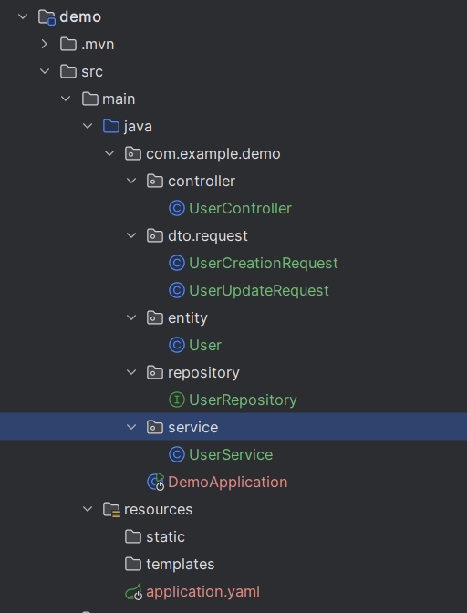
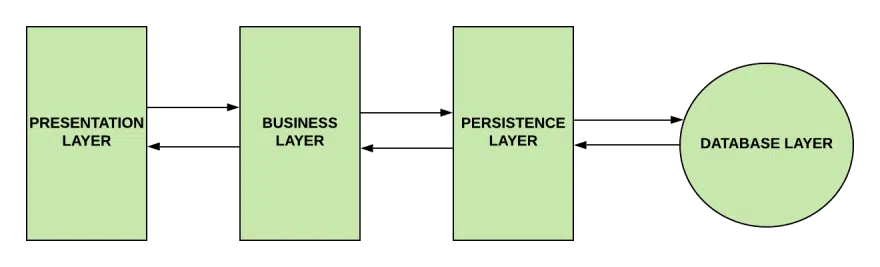

# [BUỔI 3] CRUD cơ bản
## I. Triển khai RestfullAPI trong Spring Boot
### Cấu trúc dự án

Đây là một cấu trúc dự án Spring Boot theo mô hình **Kiến trúc 3 Lớp (3-Layer Architecture)** rất chuẩn và phổ biến để xây dựng RESTful API.

### Các Lớp (Layers) Chính

Đây là 3 "lớp" xử lý logic cốt lõi của ứng dụng. Một yêu cầu (request) sẽ đi từ `Controller` -> `Service` -> `Repository`.

#### `controller`
* **Vai trò:** Đây là "cổng vào" của API. Nó chịu trách nhiệm tiếp nhận các yêu cầu HTTP (như `POST`, `GET`, `PUT`...).
* **Nhiệm vụ:**
    * Sử dụng `@RestController` để đánh dấu đây là một API controller.
    * Sử dụng `@RequestMapping` (hoặc `@GetMapping`, `@PostMapping`) để định nghĩa đường dẫn (URL) cho API.
    * Tiếp nhận dữ liệu từ client (Postman) dưới dạng `DTO` (xem mục 2).
    * **Không** chứa logic nghiệp vụ. Nó chỉ gọi `Service` để xử lý.

#### `service`
* **Vai trò:** Đây là "bộ não" xử lý logic của ứng dụng.
* **Nhiệm vụ:**
    * Sử dụng `@Service` để đánh dấu đây là nơi xử lý logic.
    * Chứa **toàn bộ** logic nghiệp vụ (ví dụ: kiểm tra username có tồn tại không, mã hóa mật khẩu, kiểm tra tuổi...).
    * Điều phối các `Repository` để lấy hoặc lưu dữ liệu.

#### `repository`
* **Vai trò:** Đây là lớp duy nhất được phép "nói chuyện" trực tiếp với cơ sở dữ liệu (Database).
* **Nhiệm vụ:**
    * Sử dụng `@Repository` và kế thừa `JpaRepository<User, Long>`.
    * Cung cấp các hàm CRUD cơ bản (như `.save()`, `.findById()`, `.findAll()`) mà không cần viết SQL.
    * Chỉ làm việc với các đối tượng `Entity` (xem mục 2).

### Các Đối Tượng Dữ Liệu

Đây là các "khuôn mẫu" dữ liệu mà ứng dụng của bạn sử dụng.

#### `entity` (Thực thể CSDL)
* **Vai trò:** Đại diện cho một **bảng** trong cơ sở dữ liệu (ví dụ: bảng `users`).
* **Nhiệm vụ:**
    * Sử dụng `@Entity` và `@Table` để ánh xạ (map) lớp Java này với bảng CSDL.
    * Sử dụng `@Id`, `@GeneratedValue` để định nghĩa khóa chính.
    * `Entity` là thứ được `Repository` lưu và lấy ra khỏi CSDL.

#### `dto.request` (Data Transfer Object)
* **Vai trò:** Đại diện cho dữ liệu JSON mà client (Postman) gửi lên.
* **Nhiệm vụ:**
    * Là một class Java (POJO) đơn giản chỉ chứa các trường (fields), getters, setters.
    * Nó giúp "che giấu" cấu trúc CSDL thật. Ví dụ: `UserCreationRequest` có `password` nhưng `User` (Entity) có thể lưu `encryptedPassword`.
    * Giúp API linh hoạt: `UserCreationRequest` (để tạo mới) có thể khác `UserUpdateRequest` (để cập nhật).

---

## II. JPA là gì? Hibernate là gì?
### 2.1 JPA (Java Persistence API) Là Gì?

**JPA** (Java Persistence API) là một **tiêu chuẩn** định nghĩa cách ánh xạ các object Java thành cơ sở dữ liệu quan hệ. 

JPA cung cấp các interface, các hàm tiện ích để thao tác CSDL quan hệ dễ dàng hơn.

**Ví dụ:** Trong Java có Class `Student` với các thuộc tính `id`, `name`, `age`. JPA định nghĩa cách để tự động ánh xạ class này thành bảng `STUDENT` trong database với các cột tương ứng.

**Bổ xung JPA vào maven**
(1) Thêm phụ thuộc vào tệp pom.xml

```xml
<dependency>
    <groupId>org.springframework.boot</groupId>
    <artifactId>spring-boot-starter-data-jpa</artifactId>
</dependency>
```

(2) Đặt annotation khởi chạy

```java
// 【Tùy chọn】Chỉ định thư mục Entity để quét, nếu không chỉ định, sẽ quét toàn bộ thư mục
@EntityScan("com.hnv99.springboot.data.jpa")
// 【Tùy chọn】Chỉ định thư mục Repository để quét, nếu không chỉ định, sẽ quét toàn bộ thư mục
@EnableJpaRepositories(basePackages = {"com.hnv99.springboot.data.jpa"})
// 【Tùy chọn】Bật khả năng kiểm tra JPA, có thể tự động gán một số trường như thời gian tạo, thời gian sửa đổi lần cuối, v.v.
@EnableJpaAuditing
@SpringBootApplication
public class Application {
    public static void main(String[] args) {
        SpringApplication.run(Application.class, args);
    }
}
```

(3) Cấu hình

```properties
# Kết nối cơ sở dữ liệu
spring.datasource.url = jdbc:mysql://localhost:3306/spring_tutorial?serverTimezone=UTC&useUnicode=true&characterEncoding=utf8
spring.datasource.driver-class-name = com.mysql.cj.jdbc.Driver
spring.datasource.username = root
spring.datasource.password = root
# Có in ra nhật ký SQL JPA hay không
spring.jpa.show-sql = true
# Chiến lược DDL của Hibernate
spring.jpa.hibernate.ddl-auto = create-drop
```
(4) Định nghĩa đối tượng Entity
(5) Định nghĩa Repository

### Truy vấn

Có các cách truy vấn sau:

- Truy vấn theo tên phương thức
    
- Truy vấn bằng cách sử dụng annotation `@Query`
    
- Truy vấn bằng cách sử dụng SQL động
    
- Truy vấn theo phong cách Example

`JpaRepository` cung cấp các truy vấn tích hợp sẵn như sau:

- `List<T> findAll();` - Trả về tất cả các entity
- `List<T> findAllById(Iterable<ID> var1);` - Trả về tất cả các entity với id đã chỉ định
- `T getOne(ID var1);` - Trả về entity với id đã chỉ định, nếu không tìm thấy, trả về null.
- `List<T> findAll(Sort var1);` - Trả về tất cả các entity, sắp xếp theo thứ tự chỉ định.
- `Page<T> findAll(Pageable var1);` - Trả về danh sách entity, phân trang theo `Pageable`.

#### Truy vấn bằng tên phương thức

Spring Data tự động xây dựng một truy vấn JPA QQL dựa trên tên phương thức và tên tham số.

```java
public interface UserRepository extends JpaRepository<User, Integer> {
    public User findByName(String name);
}
```

Tên phương thức và tên tham số cần tuân theo một số quy tắc nhất định để Spring Data JPA có thể tự động chuyển đổi thành JPQL:

- Tên phương thức thường bao gồm nhiều thuộc tính thực thể để truy vấn, các thuộc tính có thể được kết nối với nhau bằng `AND` và `OR`, cũng hỗ trợ `Between`, `LessThan`, `GreaterThan`, `Like`;
    
- Tên phương thức có thể bắt đầu bằng `findBy`, `getBy`, `queryBy`;
    
- Kết quả truy vấn có thể được sắp xếp, tên phương thức bao gồm OrderBy+ thuộc tính +ASC (DESC);
    
- Có thể sử dụng `Top`, `First` để giới hạn tập kết quả truy vấn;
    
- Một số tham số đặc biệt có thể xuất hiện trong danh sách tham số, như `Pageeable`, `Sort`.

Ví dụ:

```java
// Truy vấn theo tên, và sắp xếp theo tên tăng dần
List<Person> findByLastnameOrderByFirstnameAsc(String name);

// Truy vấn theo tên và sử dụng phân trang
Page<User> findByLastname(String lastname, Pageable pageable);

// Truy vấn 10 người dùng đầu tiên thỏa mãn điều kiện
List<User> findFirst10ByLastname(String lastname, Sort sort);

// Sử dụng And để kết hợp truy vấn
List<Person> findByFirstnameAndLastname(String firstname, String lastname);

// Sử dụng Or để truy vấn
List<Person> findDistinctPeopleByLastnameOrFirstname(String lastname, String firstname);

// Sử dụng like để truy vấn, name phải chứa % hoặc ?
public User findByNameLike(String name);
```

| Từ khóa             | Ví dụ                                                      | Đoạn JPQL tương ứng                                             |
| ------------------- | --------------------------------------------------------- | ------------------------------------------------------------------ |
| `And`               | `findByLastnameAndFirstname`                              | `… where x.lastname = ?1 and x.firstname = ?2`                     |
| `Or`                | `findByLastnameOrFirstname`                               | `… where x.lastname = ?1 or x.firstname = ?2`                      |
| `Is,Equals`         | `findByFirstname,findByFirstnameIs,findByFirstnameEquals` | `… where x.firstname = 1?`                                         |
| `Between`           | `findByStartDateBetween`                                  | `… where x.startDate between 1? and ?2`                            |
| `LessThan`          | `findByAgeLessThan`                                       | `… where x.age < ?1`                                               |
| `LessThanEqual`     | `findByAgeLessThanEqual`                                  | `… where x.age <= ?1`                                              |
| `GreaterThan`       | `findByAgeGreaterThan`                                    | `… where x.age > ?1`                                               |
| `GreaterThanEqual`  | `findByAgeGreaterThanEqual`                               | `… where x.age >= ?1`                                              |
| `After`             | `findByStartDateAfter`                                    | `… where x.startDate > ?1`                                         |
| `Before`            | `findByStartDateBefore`                                   | `… where x.startDate < ?1`                                         |
| `IsNull`            | `findByAgeIsNull`                                         | `… where x.age is null`                                            |
| `IsNotNull,NotNull` | `findByAge(Is)NotNull`                                    | `… where x.age not null`                                           |
| `Like`              | `findByFirstnameLike`                                     | `… where x.firstname like ?1`                                      |
| `NotLike`           | `findByFirstnameNotLike`                                  | `… where x.firstname not like ?1`                                  |
| `StartingWith`      | `findByFirstnameStartingWith`                             | `… where x.firstname like ?1` (tham số được bao bọc bởi `%` ở cuối)  |
| `EndingWith`        | `findByFirstnameEndingWith`                               | `… where x.firstname like ?1` (tham số được bao bọc bởi `%` ở đầu) |
| `Containing`        | `findByFirstnameContaining`                               | `… where x.firstname like ?1` (tham số được bao bọc bởi `%` ở cả hai đầu)     |
| `OrderBy`           | `findByAgeOrderByLastnameDesc`                            | `… where x.age = ?1 order by x.lastname desc`                      |
| `Not`               | `findByLastnameNot`                                       | `… where x.lastname <> ?1`                                         |
| `In`                | `findByAgeIn(Collection<Age> ages)`                       | `… where x.age in ?1`                                              |
| `NotIn`             | `findByAgeNotIn(Collection<Age> age)`                     | `… where x.age not in ?1`                                          |
| `True`              | `findByActiveTrue()`                                      | `… where x.active = true`                                          |
| `False`             | `findByActiveFalse()`                                     | `… where x.active = false`                                         |
| `IgnoreCase`        | `findByFirstnameIgnoreCase`                               | `… where UPPER(x.firstame) = UPPER(?1)`                            |

### 2.2 Hibernate
**Hibernate** là một **implementation/triển khai** của JPA. Nó là cách "thực hiện" những gì JPA định nghĩa.

**Tính năng chính của Hibernate:**
- Tự động sinh câu lệnh SQL từ code Java
- Tự động ánh xạ dữ liệu database thành Java object (ORM)
- Quản lý session và transaction
- Hỗ trợ cache

---

## III. Kiến trúc 4 lớp Spring Boot
Spring Boot chia ứng dụng thành 4 lớp chính, mỗi lớp có nhiệm vụ riêng biệt:

### 1. Presentation Layer (Lớp Trình Bày)
**Vị trí:** Đầu tiên, tiếp nhận request từ client

**Nhiệm vụ:**
- Nhận HTTP request từ client (GET, POST, PUT, DELETE)
- Chuyển đổi dữ liệu JSON thành Java objects
- Xác thực người dùng
- Gọi Service Layer để xử lý logic
- Trả về HTTP response dưới dạng JSON

Lớp presentation tương ứng với class Controller. Class Controller xử lý tất cả các REST API request (GET, POST, PUT, DELETE, PATCH) đến từ client.

**Công cụ:**
- `@RestController` - chứa các endpoint API
- `@RequestMapping`, `@GetMapping`, `@PostMapping`, v.v. - định nghĩa route
- `@RequestBody` - nhận dữ liệu từ request

**Ví dụ:**
```java
@RestController
@RequestMapping("/api/products")
public class ProductController {
    @PostMapping
    public Product createProduct(@RequestBody Product product) {
        // Request từ client vào đây
        return service.save(product);
    }
}
```

### 2. Business Layer / Service Layer (Lớp Xử Lý Logic)
**Vị trí:** Ở giữa, nhận dữ liệu từ Controller

**Nhiệm vụ:**
- Kiểm tra dữ liệu (validation)
- Xử lý các logic và quy tắc nghiệp vụ.
- Kiểm tra quyền hạn (authorization)
- Quản lý transactions (giao dịch) - @Transactional
- Gọi Repository Layer để lấy/lưu dữ liệu

Lớp này tương ứng với class Service, là nơi xử lý logic nghiệp vụ. 

**Công cụ:**
- `@Service` - đánh dấu lớp này là Service
- `@Transactional` - quản lý giao dịch cơ sở dữ liệu
- `@Autowired` - inject dependency

**Ví dụ:**
```java
@Service
public class ProductService {
    @Autowired
    private ProductRepository repository;
    
    @Transactional
    public Product createProduct(Product product) {
        // Validate dữ liệu
        if (product.getPrice() < 0) {
            throw new IllegalArgumentException("Giá không hợp lệ");
        }
        // Lưu vào database
        return repository.save(product);
    }
}
```

### 3. Persistence Layer / Data Access Layer (Lớp Truy Cập Dữ Liệu)
**Vị trị:** Tiếp theo, nhận yêu cầu từ Service

**Nhiệm vụ:**
- Tương tác với cơ sở dữ liệu
- Thực hiện các phép toán CRUD (Create, Read, Update, Delete)
- Ánh xạ Java objects thành database records (qua JPA/Hibernate) (và ngược lại)
- Thực hiện các custom queries

Lớp này tương ứng với interface Repository. Chúng ta viết các truy vấn tới database trong interface này.
Lớp Persistence là lớp duy nhất giao tiếp với lớp Business và lớp Database.

**Công cụ:**
- `@Repository` - đánh dấu lớp này là Repository
- `JpaRepository<Entity, ID>` - interface cung cấp các phương thức sẵn có
- `@Query` - định nghĩa custom queries

**Ví dụ:**
```java
@Repository
public interface ProductRepository extends JpaRepository<Product, Long> {
    @Query("SELECT p FROM Product p WHERE p.category = ?1")
    List<Product> findByCategory(String category);
}
```

### 4. Database Layer (Lớp Cơ Sở Dữ Liệu)
**Vị trí:** Cuối cùng, lưu trữ dữ liệu thực tế

**Nhiệm vụ:**
- Lưu trữ dữ liệu vật lý (MySQL, PostgreSQL, MongoDB, v.v.)
- Đảm bảo tính toàn vẹn dữ liệu
- Thực hiện indexing, query optimization

**Ví dụ:**
```sql
CREATE TABLE products (
    id BIGINT PRIMARY KEY AUTO_INCREMENT,
    name VARCHAR(255) NOT NULL,
    price DECIMAL(10, 2)
);
```
---
## IV. Request flow (dòng chảy xử lý request)
Khi một client (trình duyệt, mobile app, Postman, v.v.) gửi một HTTP request tới ứng dụng Spring Boot, request sẽ đi qua một chuỗi các bước xử lý trong Spring MVC/Spring Boot trước khi trả về response. Dưới đây là mô tả tuần tự và các thành phần chính tham gia vào dòng chảy xử lý này.

1) Client -> HTTP Server
    - Client gửi HTTP request (GET/POST/PUT/DELETE, headers, body JSON, v.v.) đến server (embedded Tomcat/Jetty/Undertow).

2) Servlet Container -> DispatcherServlet
    - Request được servlet container nhận và chuyển cho `DispatcherServlet` (điểm vào chính của Spring MVC).

3) DispatcherServlet -> Filter -> Interceptor (preHandle)
    - Các `Filter` (ví dụ filter của Spring Security, CORS filter, logging filter) có thể xử lý hoặc từ chối request trước.
    - Sau filters, các `HandlerInterceptor` được gọi (phương thức `preHandle`) để kiểm tra auth, ghi log, đo thời gian, v.v.

4) HandlerMapping -> Chọn Controller
    - `DispatcherServlet` dùng `HandlerMapping` để tra route và quyết định `Controller`/`@RequestMapping` method phù hợp.

5) Data binding & Validation
    - Nếu controller method nhận `@RequestBody`, Spring sử dụng `HttpMessageConverters` (ví dụ Jackson) để chuyển JSON -> POJO.
    - `@Valid` hoặc validator tuỳ chỉnh được chạy để kiểm tra dữ liệu đầu vào; lỗi validation sẽ ném `MethodArgumentNotValidException`.

6) Controller -> Service (Business Layer)
    - Controller nhận dữ liệu đã bind và gọi Service để xử lý logic nghiệp vụ.
    - Controller thường chỉ làm nhiệm vụ chuyển tiếp (DTO -> Service) và trả response (hoặc mã lỗi).

7) Service -> Transactional boundary
    - Các phương thức service có thể được gắn `@Transactional` để đảm bảo tính atomicity.
    - Trong service, có thể gọi nhiều repository, gọi API khác, xử lý business logic.

8) Service -> Repository (JPA/Hibernate)
    - Repository (interface mở rộng `JpaRepository` hoặc `CrudRepository`) thực hiện thao tác CRUD với DB.
    - Hibernate/JPA chuyển các thao tác entity thành SQL, gửi tới DB và nhận về kết quả.

9) Database
    - DB (MySQL/Postgres, v.v.) thực hiện câu lệnh SQL và trả kết quả (rows, generated id, v.v.).

10) Trả ngược: Repository -> Service -> Controller
     - Kết quả được trả lên service, service xử lý tiếp nếu cần, và trả về controller.
     - Controller chuyển đổi object thành JSON qua `HttpMessageConverters` và `@ResponseBody` (tự động bởi `@RestController`).

11) Interceptor (postHandle, afterCompletion) -> Filters
     - Sau khi controller xử lý xong, `postHandle` của `HandlerInterceptor` và filter `finally` logic có thể chạy để clean-up, ghi log, hoặc xử lý metrics.

12) Response -> Client
     - HTTP response (status code, headers, JSON body) được gửi về client.

Ghi chú về lỗi & ngoại lệ
 - Exceptions: Nếu có exception trong controller/service/repository, Spring sẽ chuyển qua `HandlerExceptionResolver`. Có thể tuỳ chỉnh bằng `@ControllerAdvice` (ví dụ `@ExceptionHandler`) để trả lỗi chuẩn (error response JSON, error codes).
 - Rollback: Trong phương thức `@Transactional`, khi ném runtime exception, giao dịch sẽ rollback.

Các điểm quan trọng khác
 - Security: Spring Security nằm ở lớp Filter (thường trước `DispatcherServlet`) và thực hiện authentication/authorization.
 - CORS: CORS filter/xử lý header thường ở tầng filter hoặc controller-level annotation `@CrossOrigin`.
 - Caching: Có thể cache ở tầng service (ví dụ `@Cacheable`) để giảm truy vấn DB.
 - Async: Với `@Async` hoặc WebFlux/Reactive, luồng xử lý có thể bất đồng bộ; điểm vào/thoát thay đổi tương ứng.
 - DTOs & Mappers: Thông thường dùng DTO cho request/response để không lộ entity trực tiếp.

Ví dụ tóm tắt (dạng chuỗi):
Client -> Network -> Servlet Container -> DispatcherServlet -> Filters -> Interceptors(pre) -> HandlerMapping -> Controller -> Service(@Transactional) -> Repository(JPA/Hibernate) -> Database -> Repository result -> Service -> Controller -> Interceptor(post) -> Filters -> DispatcherServlet -> HTTP Response -> Client

Tip thực hành
 - Luôn giữ controller mỏng: chuyển logic vào service.
 - Rõ ràng ranh giới transaction: đánh dấu `@Transactional` ở service method đúng phạm vi.
 - Dùng `@ControllerAdvice` để chuẩn hoá lỗi trả về.
 - Ghi log request/response (không log sensitive data).

---
## V. Cấu hình DataSource

Spring Boot cung cấp một loạt các cấu hình `spring.datasource.*` để điều khiển cấu hình `DataSource`. Người dùng có thể chỉ định cấu hình Data Source trong tệp `application.properties` hoặc `application.yml`. Các cấu hình này được duy trì trong `DataSourcePropertie`.

Dưới đây là một ví dụ cấu hình Data Source MySQL cơ bản (tất cả các trường đều là bắt buộc):
```properties
# Địa chỉ truy cập cơ sở dữ liệu
spring.datasource.url = jdbc:mysql://localhost:3306/spring_tutorial?serverTimezone=UTC&useUnicode=true&characterEncoding=utf8
# Lớp trình điều khiển cơ sở dữ liệu, đảm bảo lớp trình điều khiển có thể tải được
spring.datasource.driver-class-name = com.mysql.cj.jdbc.Driver
# Tên người dùng cơ sở dữ liệu
spring.datasource.username = root
# Mật khẩu người dùng cơ sở dữ liệu
spring.datasource.password = root
```
Hãy thay thế `url`, `username`, `password` bằng thông tin thực tế

---
## VI. Tìm hiểu các Annotation : @RestController, @Service, @Repository, @Entity, @Table, @Id, @Transactional, @Query ...
### @RestController
- Dùng cho **REST APIs** (trả JSON/XML)
- Kết hợp `@Controller + @ResponseBody`
- Tự động convert object thành JSON

```java
@RestController
@RequestMapping("/api/users")
public class UserController {
    @GetMapping("/{id}")
    public User getUser(@PathVariable Long id) {
        return new User(id, "John", "john@example.com");
        // Tự động convert thành JSON
    }
}
```

**Response:**
```json
{
  "id": 1,
  "name": "John",
  "email": "john@example.com"
}
```

### @Controller
- Dùng cho **MVC apps** (trả HTML views)
- Cần thêm `@ResponseBody` để trả JSON

```java
@Controller
public class HomeController {
    @GetMapping("/home")
    public String home(Model model) {
        model.addAttribute("message", "Welcome");
        return "home"; // Trả về file home.html/home.jsp
    }
}
```

### 2. @Service
- Đánh dấu một lớp là **Service** (xử lý business logic)
- Spring tự động tạo bean cho class này
- Cho phép sử dụng `@Transactional`

```java
@Service
public class UserService {
    @Autowired
    private UserRepository repository;
    
    public User createUser(User user) {
        // Xử lý logic ở đây
        return repository.save(user);
    }
}
```

**Lợi ích:**
- Tách biệt business logic khỏi controller
- Dễ test (có thể mock service)
- Dễ tái sử dụng (service có thể dùng từ nhiều controller)

### 3. @Repository
- Đánh dấu một interface/class là **Data Access Object (DAO)**
- Cung cấp các phương thức để tương tác database
- Tự động dịch các database exceptions

```java
@Repository
public interface UserRepository extends JpaRepository<User, Long> {
    User findByEmail(String email);
}
```

**JpaRepository cung cấp:**
- `save(entity)` - Lưu/cập nhật
- `findById(id)` - Tìm theo ID
- `findAll()` - Lấy tất cả
- `delete(entity)` - Xóa
- `deleteById(id)` - Xóa theo ID
### 4. @Entity
- Đánh dấu một class là **Entity** (đại diện cho bảng database)
- Mỗi attribute là một column trong bảng

```java
@Entity
@Table(name = "users")
public class User {
    @Id
    private Long id;
    
    private String name;
    private String email;
}
```

### 5. @Table
- Định nghĩa tên bảng database
- Nếu không dùng `@Table`, tên bảng = tên class

```java
@Entity
@Table(name = "users") // Bảng tên là "users" chứ không phải "User"
public class User {
    // ...
}
```

**Với constraints:**
```java
@Entity
@Table(name = "users", uniqueConstraints = {
    @UniqueConstraint(columnNames = {"email"})
})
public class User {
    // ...
}
```

### 6. @Id
- Đánh dấu **primary key** của entity
- Mỗi entity phải có một `@Id`

```java
@Entity
public class User {
    @Id
    @GeneratedValue(strategy = GenerationType.IDENTITY)
    private Long id;
    // ...
}
```

**GenerationType:**
- `IDENTITY` - Auto increment (MySQL)
- `SEQUENCE` - Dùng sequence (PostgreSQL, Oracle)
- `TABLE` - Dùng một bảng để quản lý
- `AUTO` - Spring tự chọn

### 7. @Column
- Định nghĩa chi tiết của column (tên, độ dài, nullable, v.v.)

```java
@Entity
public class User {
    @Id
    private Long id;
    
    @Column(name = "full_name", length = 100, nullable = false)
    private String name;
    
    @Column(nullable = false, unique = true)
    private String email;
    
    @Column(columnDefinition = "VARCHAR(500)")
    private String bio;
}
```

**Các tham số:**
- `name` - Tên column trong database
- `length` - Độ dài tối đa (varchar)
- `nullable` - Có cho phép NULL không
- `unique` - Giá trị phải duy nhất
- `columnDefinition` - Định nghĩa SQL tùy chỉnh

### 8. @Transactional
- Quản lý **transactions** (giao dịch) cơ sở dữ liệu
- Tự động commit nếu thành công, rollback nếu lỗi
- Theo nguyên tắc ACID (Atomicity, Consistency, Isolation, Durability)

```java
@Service
public class UserService {
    @Autowired
    private UserRepository userRepository;
    
    @Autowired
    private AccountRepository accountRepository;
    
    @Transactional
    public void transferMoney(User from, User to, double amount) {
        // Nếu có lỗi ở bất kỳ dòng nào, cả 2 operation sẽ rollback
        from.setBalance(from.getBalance() - amount);
        userRepository.save(from);
        
        to.setBalance(to.getBalance() + amount);
        userRepository.save(to);
        
        // Log transaction
        accountRepository.saveLog(from.getId(), to.getId(), amount);
    }
}
```
### @GeneratedValue
Chỉ định cách tự động sinh giá trị cho @Id.

```java
@Entity
public class Student {
    @Id
    @GeneratedValue(strategy = GenerationType.IDENTITY)
    private Long id;
    // Strategy = IDENTITY: MySQL tự động tăng id
}
```

**Các strategy khác:**
- `GenerationType.AUTO`: Spring tự chọn strategy phù hợp
- `GenerationType.SEQUENCE`: Dùng database sequence (PostgreSQL, Oracle)
- `GenerationType.TABLE`: Dùng bảng riêng để quản lý ID

## VII. Bài tập: Chọn 1 module của 1 đề tài trong sheet bên dưới, làm 1 ứng dụng với module đó. Dùng @RestController để viết endpoint của API, dùng @Service để xử lý các logic CRUD, @Repository để xử lý thao tác với database, @Entity để tạo các ORM với DB
Lưu ý áp dụng tất cả các Annotation đã tìm hiểu