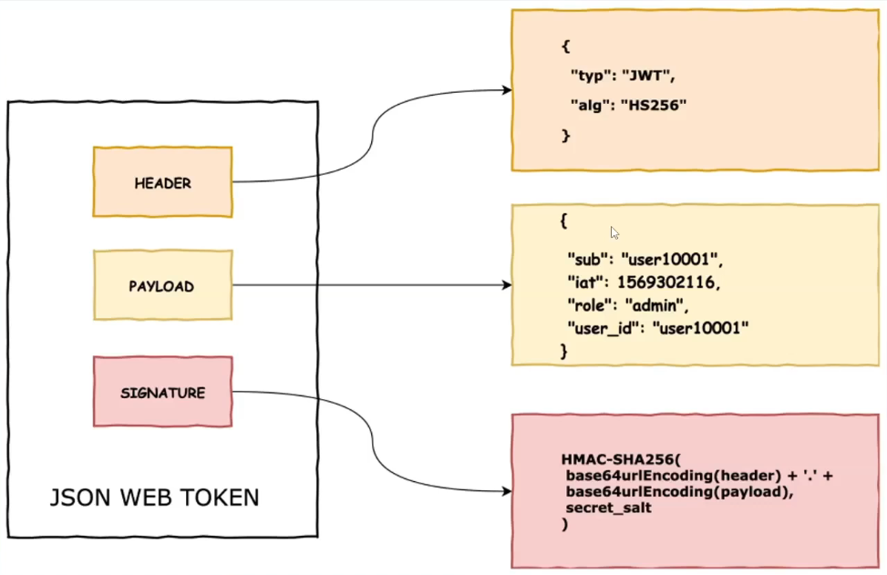
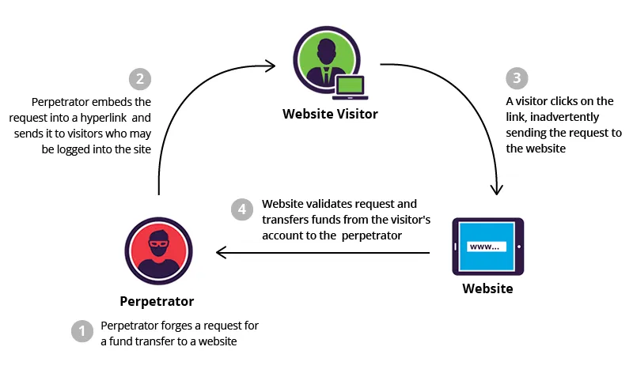

# Buổi 6: Tìm Hiểu Spring Security, JWT, Authentication & Authorization

## I. Authentication (Xác thực) và Authorization (Phân quyền)

### 1. Phân biệt hai khái niệm cơ bản

Đây là hai khái niệm thường bị nhầm lẫn nhưng lại hoàn toàn khác biệt. Hãy tưởng tượng bạn đang đến một sự kiện ca nhạc:

| Khái niệm         | Câu hỏi chính          | Ví dụ đời thực                                                                 |
|-------------------|-------------------------|---------------------------------------------------------------------------------| 
| **Authentication**| "Bạn là ai?"          | Soát vé + CMND/CCCD để kiểm tra bạn có đúng là người sở hữu vé hay không       |
| **Authorization** | "Bạn được làm gì?"    | Vé VIP vào khu vực gần sân khấu, vé thường chỉ ở khán đài                      |

Hai bước này luôn đi **theo thứ tự**:
- Bước 1: Xác thực (Authentication) – chứng minh danh tính
- Bước 2: Phân quyền (Authorization) – xem bạn được phép làm gì trong hệ thống

Nếu ví hệ thống là một tòa nhà:
- Authentication = kiểm tra bạn có thẻ ra vào tòa nhà không
- Authorization  = kiểm tra bạn được lên tầng mấy, vào phòng nào

---

### 2. Authentication (Xác thực) - "Bạn là ai?"

**Định nghĩa**: Là quá trình xác minh danh tính của một người dùng. Hệ thống cần chắc chắn rằng bạn chính là người mà bạn tuyên bố (ví dụ: bạn thực sự là sinh viên có mã số `maSV = "SV001"`).

**Trong dự án (`AuthenticationService.java`)** luồng xử lý như sau:
1. Người dùng gửi `maSV` (username) và `matKhau` (password) qua endpoint `POST /api/auth/login`
2. Hệ thống tìm bản ghi `User` trong database dựa trên `maSV`
3. Hệ thống dùng `PasswordEncoder` (BCrypt) để so sánh `matKhau` người dùng gửi lên với mật khẩu đã được mã hóa trong database
4. Nếu khớp, quá trình **xác thực thành công** và hệ thống sinh ra một **JWT** đại diện cho phiên đăng nhập

```java
// Trích đoạn từ AuthenticationService.java
public AuthenticationResponse authenticate(AuthenticationReqest request) throws JOSEException {
    // 1. Tìm user bằng maSV
    var user = userRepository.findByMaSV(request.getMaSV())
            .orElseThrow(() -> new AppException(ErrorCode.SV_NOT_FOUND));

    // 2. So sánh mật khẩu (plaintext từ client với mật khẩu đã mã hóa trong DB)
    PasswordEncoder passwordEncoder = new BCryptPasswordEncoder(10);
    boolean authenticated = passwordEncoder.matches(request.getMatKhau(), user.getMatKhau());

    // 3. Nếu không khớp -> Lỗi xác thực
    if (!authenticated) {
        throw new AppException(ErrorCode.UNAUTHENTICATED);
    }

    // 4. Xác thực thành công -> Tạo JWT token
    var token = generateToken(user);
    return AuthenticationResponse.builder()
            .token(token)
            .isAuthenticated(true)
            .build();
}
```

#### 2.1. Vì sao phải mã hóa mật khẩu với BCrypt?

Trong lớp `UserService`, khi tạo mới người dùng, mật khẩu **không** được lưu dạng plain-text mà được mã hóa với `PasswordEncoder`:

```java
public UserResponse createUser(UserRequest request) {
    if (userRepository.existsByMaSV(request.getMaSV()))
        throw new AppException(ErrorCode.USER_EXISTED);

    User user = userMapper.toEntity(request);

    // Mã hóa mật khẩu trước khi lưu DB
    user.setMatKhau(passwordEncoder.encode(request.getMatKhau()));

    HashSet<String> roles = new HashSet<>();
    roles.add(Role.ROLE_USER.name());
    user.setRoles(roles);

    User savedUser = userRepository.save(user);
    return userMapper.toResponse(savedUser);
}
```

**Lý do dùng BCrypt:**
- Là thuật toán **băm một chiều** (one-way hash) → không thể giải ngược ra mật khẩu gốc
- Tự động sinh **salt** (chuỗi ngẫu nhiên) → nếu hai người dùng cùng mật khẩu, chuỗi băm vẫn khác nhau
- Có tham số **strength** (ở đây là 10) để điều chỉnh độ tốn thời gian → giúp chống tấn công brute-force

Nhờ đó, ngay cả khi database bị lộ, kẻ tấn công cũng rất khó khôi phục được mật khẩu gốc.

#### 2.2. Quy trình xác thực tổng quát trong hệ thống

Tóm tắt lại workflow xác thực (theo dự án):

1. **Client** gửi request `POST /api/auth/login` với `maSV`, `matKhau`
2. **Controller** (`AuthenticationController`) gọi xuống `AuthenticationService.authenticate()`
3. **Service**:
   - Tìm `User` trong database
   - So sánh mật khẩu (BCrypt)
   - Nếu đúng → sinh JWT chứa thông tin user + roles
4. **Client** lưu JWT và sử dụng cho các request tiếp theo (đặt trong header `Authorization: Bearer <token>`)

---

### 3. Authorization (Phân quyền) - "Bạn được phép làm gì?"

**Định nghĩa**: Là bước kiểm tra **quyền hạn** của một người dùng sau khi đã xác thực. Không phải ai đã đăng nhập cũng được phép làm mọi thứ.

**Ví dụ trong đời thực**:
- Giảng viên có thể xem danh sách tất cả sinh viên
- Sinh viên chỉ được xem thông tin của chính mình

Trong dự án, quyền hạn được biểu diễn thông qua **Role**:
- `ROLE_ADMIN`: quản trị viên, có nhiều quyền hơn
- `ROLE_USER`: người dùng bình thường

#### 3.1. Phân quyền dựa trên URL (Configuration-based)

Trong `SecurityConfig.java`, phân quyền cơ bản dựa trên đường dẫn và HTTP method:

```java
http.authorizeHttpRequests(request ->
    request.requestMatchers(HttpMethod.POST, "/api/user", "/api/auth/login").permitAll()
           .anyRequest().authenticated() // Các request khác chỉ cần đăng nhập
);
```

Ý nghĩa:
- `POST /api/auth/login` và `POST /api/user` là **public** (không cần token)
- Các endpoint còn lại phải **cung cấp JWT hợp lệ** (đã đăng nhập)

Trong tài liệu này ta có thể mở rộng thành:
- Nếu muốn chỉ `ADMIN` mới xem được danh sách user, có thể cấu hình:

```java
request.requestMatchers(HttpMethod.GET, "/api/user", "/api/user/**")
       .hasAuthority("ROLE_ADMIN");
```

#### 3.2. Phân quyền dựa trên method (@PreAuthorize, @PostAuthorize)

Ngoài phân quyền theo URL, dự án còn dùng **annotation trên method service**. Điều này cho phép kiểm soát chi tiết hơn theo logic nghiệp vụ.

Ví dụ trong `UserService`:

```java
// Chỉ ADMIN mới được xem danh sách tất cả user
@PreAuthorize("hasAuthority('ROLE_ADMIN')")
public List<UserResponse> getUsers() {
    log.info("In method get Users");
    return userRepository.findAll().stream().map(userMapper::toResponse).toList();
}

// Chỉ cho phép trả về user có maSV trùng với người đang đăng nhập
@PostAuthorize("returnObject.maSV == authentication.name")
public UserResponse getUser(String id) {
    log.info("In method get User with id: {}", id);
    return userMapper.toResponse(
            userRepository.findByMaSV(id).orElseThrow(() -> new AppException(ErrorCode.SV_NOT_FOUND))
    );
}
```

Giải thích chi tiết sự khác nhau giữa `@PreAuthorize` và `@PostAuthorize`:

- `@PreAuthorize(...)`:
    - Thời điểm chạy: kiểm tra **TRƯỚC KHI** method được thực thi.
    - Quyết định xem method có được gọi hay không.
    - Thường dùng cho các rule chỉ dựa trên **thông tin hiện tại** của user (roles, username, ...)
        và **tham số đầu vào** của hàm.
    - Ví dụ: `@PreAuthorize("hasAuthority('ROLE_ADMIN')")` đảm bảo chỉ ADMIN mới được vào `getUsers()`.

- `@PostAuthorize(...)`:
    - Thời điểm chạy: kiểm tra **SAU KHI** method đã thực thi xong và **đã có kết quả trả về**.
    - Cho phép viết rule dựa trên **giá trị trả về** (`returnObject`).
    - Thích hợp cho các trường hợp cần kiểm tra chi tiết trên dữ liệu đã lấy ra, ví dụ chỉ cho xem user mà
        `maSV` khớp với người đang đăng nhập.
    - Trong ví dụ trên, biểu thức `returnObject.maSV == authentication.name` đảm bảo rằng:
        - `returnObject.maSV`: mã sinh viên trong **kết quả trả về**.
        - `authentication.name`: mã sinh viên của người đang đăng nhập (lấy từ JWT).
        - Nếu không trùng → request bị từ chối (403 Forbidden).

Nhờ kết hợp cả hai:
- `@PreAuthorize` dùng để chặn **từ ngoài cổng** (ai được phép gọi method).
- `@PostAuthorize` dùng để chặn **sau khi đã lấy dữ liệu**, bảo đảm chỉ trả về dữ liệu phù hợp với user hiện tại.

#### 3.3. Lấy thông tin user đang đăng nhập từ SecurityContextHolder

`SecurityContextHolder` là nơi Spring Security lưu trữ thông tin `Authentication` tương ứng với request hiện tại.

Ví dụ trong `UserService.getMyInfo()`:

```java
public UserResponse getMyInfo() {
    var context = SecurityContextHolder.getContext();
    String name = context.getAuthentication().getName(); // maSV hiện tại

    User user = userRepository.findByMaSV(name)
            .orElseThrow(() -> new AppException(ErrorCode.SV_NOT_FOUND));
    return userMapper.toResponse(user);
}
```

Từ đó, API `GET /api/user/myInfo` luôn trả về **đúng** thông tin của user hiện đang đăng nhập, không phụ thuộc vào tham số path.

**Tóm lại**: 
- Bạn phải **xác thực** trước (có JWT hợp lệ)
- Sau đó hệ thống mới kiểm tra **phân quyền** (role, authority, biểu thức SpEL) để quyết định bạn được làm gì.

---

## II. Spring Security - Người Gác Cổng 

Spring Security là một framework mạnh mẽ và tùy biến cao, cung cấp cả khả năng xác thực (**Authentication**) và phân quyền (**Authorization**) cho ứng dụng. Nó hoạt động như một **chuỗi các bộ lọc (Security Filter Chain)** mà mọi yêu cầu (request) đều phải đi qua trước khi đến được controller.

### 1. Luồng hoạt động cơ bản trong dự án


1. **Client gửi Request**: Một request đến server, ví dụ `GET /api/user`, kèm theo một JWT trong `Authorization` header:
    ```
    Authorization: Bearer <jwt_token>
    ```
2. **SecurityFilterChain**: Request đi vào chuỗi bộ lọc của Spring Security (được cấu hình bởi bean `SecurityFilterChain`)
3. **Bộ lọc JWT của Resource Server**:
    - Spring Security nhận diện đây là ứng dụng kiểu **Resource Server** sử dụng JWT
    - Nó dùng `JwtDecoder` để giải mã và **xác thực chữ ký** của token (dựa trên `signerKey` trong `application.yaml`)
    - Nếu token hợp lệ, nó trích xuất các thông tin (claims) bên trong
4. **JwtAuthenticationConverter**:
    - Bean này chịu trách nhiệm "dịch" thông tin từ JWT sang đối tượng `Authentication` mà Spring Security hiểu
    - Dự án cấu hình cho nó đọc claim `"roles"` (ví dụ: `["ROLE_ADMIN"]`)
    - Mỗi role trong mảng sẽ được chuyển thành một `GrantedAuthority`
5. **SecurityContextHolder**:
    - Đối tượng `Authentication` (chứa username + danh sách quyền) được lưu vào `SecurityContextHolder`
    - Từ thời điểm này, ở bất kỳ đâu trong request (service, controller), ta đều có thể lấy ra thông tin user đang đăng nhập
6. **AuthorizationFilter / @PreAuthorize**:
    - Dựa trên cấu hình trong `SecurityConfig` và các annotation như `@PreAuthorize`, framework sẽ kiểm tra xem user có đủ quyền hay không
    - Nếu có quyền → cho phép đi tiếp
    - Nếu không → trả về 403 Forbidden
7. **Controller / Service**:
    - Khi vượt qua hết các lớp bảo vệ, request mới thực sự đến controller (`UserController`, `RegistrationController`, ...)


### 2. Cấu hình chính trong `SecurityConfig.java`

#### 2.1. Cài đặt thư viện OAuth2 cho Spring Security

Để Spring Security hiểu và xử lý được JWT theo chuẩn OAuth2 Resource Server, trong `pom.xml`  khai báo 2 dependency quan trọng:

```xml
<dependency>
        <groupId>org.springframework.boot</groupId>
        <artifactId>spring-boot-starter-security</artifactId>
</dependency>

<dependency>
        <groupId>org.springframework.boot</groupId>
        <artifactId>spring-boot-starter-oauth2-resource-server</artifactId>
</dependency>
```

Ý nghĩa từng thư viện:
- `spring-boot-starter-security`:
    - Cung cấp core Spring Security: filter chain, `SecurityContextHolder`, cơ chế authentication/authorization cơ bản.
    - Nếu chỉ dùng starter này, bạn sẽ phải tự cấu hình cách xác thực (form-login, HTTP Basic, custom filter, v.v.).
- `spring-boot-starter-oauth2-resource-server`:
    - Bổ sung đầy đủ các **OAuth2 Resource Server features**, trong đó có hỗ trợ **JWT Bearer Token**.
    - Tự động đăng ký các filter cần thiết để đọc header `Authorization: Bearer <token>` và chuyển nó thành `Authentication`.
    - Tích hợp sẵn với các bean như `JwtDecoder`, `JwtAuthenticationConverter`, giúp code trong `SecurityConfig` ngắn gọn hơn.

Lý do chọn `spring-boot-starter-oauth2-resource-server` thay vì tự viết filter kiểm tra JWT thủ công:
- Đây là **thư viện chính chủ** của Spring Security (kể từ Spring Security 5+ và Spring Boot 2.1+), được khuyến nghị trong tài liệu chính thức.
- Đã được tối ưu về **bảo mật** và **hiệu năng**, thường xuyên được cập nhật bản vá.
- Giảm rất nhiều **boilerplate code**: không cần tự parse header, tự verify signature cho mỗi request, mà chỉ cần cấu hình `jwtDecoder()` + `oauth2ResourceServer().jwt()`.

#### 2.2 Cấu hình SecurityConfig


```java
@Configuration
@EnableMethodSecurity
public class SecurityConfig {
    
    @Value("${jwt.signerKey}")
    private String signerKey;

    @Bean
    public PasswordEncoder passwordEncoder() {
        return new BCryptPasswordEncoder(10);
    }

    @Bean
    public SecurityFilterChain securityFilterChain(HttpSecurity http) throws Exception {
        http.authorizeHttpRequests(request ->
                request.requestMatchers(HttpMethod.POST, "/api/user", "/api/auth/login").permitAll()
                // Các request khác phải đăng nhập (có JWT hợp lệ)
                .anyRequest().authenticated());

        http.oauth2ResourceServer(oauth2 ->
                oauth2.jwt(jwtConfigurer -> jwtConfigurer
                        .decoder(jwtDecoder())
                        .jwtAuthenticationConverter(jwtAuthenticationConverter()))
        );

        http.csrf(AbstractHttpConfigurer::disable);
        return http.build();
    }

    @Bean
    JwtDecoder jwtDecoder() {
        SecretKeySpec key = new SecretKeySpec(signerKey.getBytes(), "HS256");
        return NimbusJwtDecoder
                .withSecretKey(key)
                .macAlgorithm(MacAlgorithm.HS256)
                .build();
    }

    @Bean
    public JwtAuthenticationConverter jwtAuthenticationConverter() {
        JwtGrantedAuthoritiesConverter grantedAuthoritiesConverter = new JwtGrantedAuthoritiesConverter();
        grantedAuthoritiesConverter.setAuthoritiesClaimName("roles");
        grantedAuthoritiesConverter.setAuthorityPrefix("");

        JwtAuthenticationConverter converter = new JwtAuthenticationConverter();
        converter.setJwtGrantedAuthoritiesConverter(grantedAuthoritiesConverter);
        return converter;
    }
}
```

**Các thành phần quan trọng:**
- **`@Configuration`**: Đánh dấu đây là lớp cấu hình Spring
- **`@EnableMethodSecurity`**: Kích hoạt security ở mức method, cho phép dùng `@PreAuthorize`, `@PostAuthorize`, `@Secured`, ...
- **`PasswordEncoder` Bean**: Cung cấp cơ chế mã hóa mật khẩu an toàn (BCrypt) – được inject vào `UserService`
- **`SecurityFilterChain` Bean**: Định nghĩa các quy tắc bảo mật cho từng endpoint, thay thế cho cấu hình XML cũ
- **`oauth2ResourceServer().jwt()`**: Khai báo ứng dụng đóng vai trò **Resource Server** sử dụng JWT để xác thực
- **`JwtDecoder`**: Chịu trách nhiệm giải mã và xác thực chữ ký JWT
- **`JwtAuthenticationConverter`**: Chuyển claim `roles` trong JWT thành các `GrantedAuthority`

### 3. SecurityContextHolder và Thread-local

`SecurityContextHolder` sử dụng cơ chế **Thread-local** để gắn thông tin bảo mật với thread đang xử lý request:

- Mỗi request HTTP thường được xử lý bởi một thread riêng
- Spring Security lưu `SecurityContext` (bên trong chứa `Authentication`) vào một vùng nhớ riêng của thread đó
- Nhờ vậy, trong bất kỳ lớp nào (service, controller) ta đều có thể gọi:
  ```java
  SecurityContextHolder.getContext().getAuthentication();
  ```
  để lấy ra thông tin người dùng hiện tại mà **không phải truyền tay** qua từng method.

### 4. CSRF và lý do tắt trong API REST

Trong cấu hình, dự án **tắt CSRF**:

```java
http.csrf(AbstractHttpConfigurer::disable);
```

**CSRF (Cross-Site Request Forgery)** là kỹ thuật tấn công lợi dụng việc trình duyệt tự động gửi cookie. Với mô hình **session-based** (dùng JSESSIONID), CSRF rất nguy hiểm.

Tuy nhiên, trong kiến trúc **RESTful API + JWT**:
- Client thường lưu token trong Local Storage hoặc tự quản lý header `Authorization`
- Trình duyệt **không tự động** gửi JWT như cookie
- Mỗi request phải chủ động gắn `Authorization: Bearer <token>`

Vì vậy, trong nhiều API thuần backend như dự án này, việc tắt CSRF là chấp nhận được. Nếu sau này dùng **form-login + session**, cần bật lại CSRF để an toàn hơn.

### 5. Phân quyền theo URL or theo method

Trong Spring Security, có hai cách phổ biến để phân quyền:

1. **Theo URL** (ở `SecurityConfig`):
    - Dễ nhìn tổng quan toàn bộ API
    - Phù hợp với các rule đơn giản theo đường dẫn
2. **Theo method** (ở `UserService` với `@PreAuthorize`, `@PostAuthorize`):
    - Bám sát nghiệp vụ hơn (business-centric)
    - Có thể viết rule phức tạp bằng SpEL (ví dụ so sánh `returnObject.maSV` với `authentication.name`)

Trong thực tế, ta thường **kết hợp cả hai**:
- URL-level: chặn những endpoint rõ ràng chỉ dành cho admin
- Method-level: kiểm soát chi tiết từng nghiệp vụ, từng entity

---

## III. JWT (JSON Web Token) 

Trong các ứng dụng hiện đại (đặc biệt là kiến trúc microservices hoặc SPA), việc duy trì session trên server trở nên bất tiện. JWT ra đời để giải quyết vấn đề này.

**JWT là một chuỗi JSON được mã hóa, hoạt động như một "giấy thông hành" tự chứa đầy đủ thông tin.**

### 1. Cấu trúc của một JWT

Một JWT gồm 3 phần, ngăn cách bởi dấu chấm (`.`):

```text
header.payload.signature
```

#### 1.1. Header (Tiêu đề)

Chứa thông tin về thuật toán mã hóa được sử dụng và loại token.

```java
// Trong AuthenticationService.java
JWSHeader header = new JWSHeader(JWSAlgorithm.HS256);
```

Ví dụ header (dưới dạng JSON):

```json
{
  "alg": "HS256",
  "typ": "JWT"
}
```

#### 1.2. Payload (Dữ liệu)

Chứa các "claims" (thông tin) về người dùng và token:

- **`sub` (Subject)**: Chủ thể của token (ID người dùng)
- **`iss` (Issuer)**: Tổ chức phát hành token
- **`iat` (Issued At)**: Thời điểm token được phát hành
- **`exp` (Expiration Time)**: Thời điểm token hết hạn
- **Custom Claims**: Thông tin tùy chỉnh (như `roles`)

```java
// Trong AuthenticationService.java
JWTClaimsSet claimsSet = new JWTClaimsSet.Builder()
          .subject(user.getMaSV())            // Ai?
          .issuer("qlsv-dkmh")               // Ai cấp?
          .issueTime(new Date())              // Khi nào cấp?
          .expirationTime(new Date(
                     Instant.now().plus(1, ChronoUnit.HOURS).toEpochMilli()
          ))                                   // Khi nào hết hạn?
          .claim("roles", user.getRoles())   // Có quyền gì?
          .build();
```

Ví dụ payload:

```json
{
  "iss": "qlsv-dkmh",
  "sub": "SV001",
  "iat": 1737262800,
  "exp": 1737266400,
  "roles": ["ROLE_USER"]
}
```

#### 1.3. Signature (Chữ ký)

Phần quan trọng nhất để đảm bảo **tính toàn vẹn** (integrity) của token. Để tạo ra được chữ ký chúng ta sẽ phải có: base64Url encoded header, base64Url encoded payload, secret key, sign algorithm:

```java
// Tạo chữ ký
JWSHeader header = new JWSHeader(JWSAlgorithm.HS256);
Payload payload = new Payload(claimsSet.toJSONObject());
JWSObject jwsObject = new JWSObject(header, payload);

jwsObject.sign(new MACSigner(SIGNING_KEY.getBytes()));
return jwsObject.serialize();
```

**Tại sao chữ ký quan trọng?**
- Chữ ký được tạo bằng cách mã hóa `header + payload + secret key`
- Khi server nhận token, nó **lặp lại quá trình** tạo chữ ký
- Nếu chữ ký khớp → token hợp lệ và **chưa bị chỉnh sửa**
- Nếu ai đó sửa payload (VD: đổi `roles` từ `ROLE_USER` thành `ROLE_ADMIN`) → chữ ký không còn khớp, token bị coi là không hợp lệ

### 2. Luồng hoạt động với JWT trong hệ thống

1. **Đăng nhập**: User gửi `maSV` + `matKhau` → Server xác thực với BCrypt
2. **Cấp Token**: Nếu xác thực thành công, server tạo JWT và trả về cho client dưới dạng chuỗi
3. **Lưu Token phía client**: 
    - Thường lưu trong Local Storage, Session Storage hoặc bộ nhớ của mobile app
    - Không nên lưu trong cookie không bảo mật
4. **Gửi Request kèm Token**: Mọi request sau đó đều gửi token trong header:

    ```
    Authorization: Bearer <jwt_token>
    ```

5. **Server xác thực Token**:
    - Giải mã token (decode base64)
    - Kiểm tra chữ ký với `SIGNING_KEY`
    - Kiểm tra hạn sử dụng (`exp` > thời điểm hiện tại)
    - Nếu hợp lệ → tạo `Authentication` và lưu vào `SecurityContextHolder`
    - Hệ thống sẽ sử dụng JWT này để xác thực và phân quyền người dùng được phép truy cập vào những tài nguyên, services, APIs nào của hệ thống.


### 4. Kiểm tra (introspect) JWT trong hệ thống

Dự án hiện tại có endpoint `POST /api/auth/introspect` để kiểm tra một token bất kỳ còn hợp lệ hay không. Logic nằm trong `AuthenticationService.introspectResponse`:

```java
public IntrospectResponse introspectResponse(IntrospectRequest request) throws JOSEException, ParseException {
     var token = request.getToken();

     JWSVerifier verifier = new MACVerifier(SIGNING_KEY.getBytes());
     SignedJWT signedJWT = SignedJWT.parse(token);

     Date expiryTime = signedJWT.getJWTClaimsSet().getExpirationTime();

     var verified = signedJWT.verify(verifier);
     return IntrospectResponse.builder()
                .valid(verified && expiryTime.after(new Date()))
                .build();
}
```

Ý nghĩa:
- `MACVerifier` dùng cùng `SIGNING_KEY` để kiểm tra chữ ký
- Nếu chữ ký đúng **và** thời gian hiện tại < `exp` → token hợp lệ (`valid = true`)
- Endpoint này rất hữu ích khi một service khác muốn hỏi "token này còn dùng được không?".

### 5. Ưu điểm và nhược điểm của JWT

**Ưu điểm:**
- **Stateless**: Server không cần lưu session, dễ scale theo chiều ngang (nhiều instance)
- **Tự chứa thông tin**: Trong token đã có sẵn thông tin user, roles, không cần truy vấn DB ở mỗi request (tùy chiến lược)
- **Phù hợp microservices**: Dễ dàng chia sẻ token giữa nhiều service

**Nhược điểm / Lưu ý:**
- **Không dễ thu hồi sớm**: Nếu token còn hạn, việc "log out từ xa" hoặc thu hồi token cần cơ chế bổ sung (token blacklist, rotate, ...)
- **Kích thước lớn hơn session-id**: Payload chứa nhiều claim làm header HTTP dài hơn
- **Bảo mật phía client**: Nếu lưu JWT không an toàn (bị XSS), kẻ tấn công có thể giả mạo user


### Ứng dụng thực tế trong dự án:

- **User đăng ký**: Mật khẩu được mã hóa bằng BCrypt
- **User đăng nhập**: Xác thực và cấp JWT token
- **Phân quyền**: Admin có thể xem tất cả user, User chỉ xem được thông tin của mình
- **Bảo mật API**: Mọi endpoint đều được bảo vệ, trừ các endpoint công khai

---

# Tài liệu về Bảo mật

## 1. Lưu mật khẩu người dùng, mã hóa và giải mã

### **Lưu mật khẩu**
Trong dự án này, mật khẩu người dùng được lưu trữ an toàn bằng cách sử dụng `BCryptPasswordEncoder` được cung cấp bởi Spring Security. Điều này đảm bảo rằng mật khẩu được băm trước khi lưu vào cơ sở dữ liệu, làm cho việc đảo ngược băm trở nên không khả thi.

- **Cách triển khai**:
  - Lớp `SecurityConfig` định nghĩa một bean `PasswordEncoder` sử dụng `BCryptPasswordEncoder` với độ mạnh là 10.
  - Ví dụ:
    ```java
    @Bean
    public PasswordEncoder passwordEncoder() {
        return new BCryptPasswordEncoder(10);
    }
    ```

- **Tại sao sử dụng BCrypt?**
  - BCrypt là một thuật toán băm mạnh được thiết kế đặc biệt cho việc băm mật khẩu.
  - Nó bao gồm một salt để bảo vệ chống lại các cuộc tấn công bảng tra cứu (rainbow table).
  - Chi phí tính toán có thể được điều chỉnh để duy trì tính bảo mật khi phần cứng cải tiến.

### **Mã hóa và giải mã**
Dự án sử dụng JWT (JSON Web Tokens) để xác thực. Lớp `AuthenticationService` xử lý việc tạo và xác thực JWT.

- **Ký JWT**:
  - `MACSigner` được sử dụng để ký JWT với một khóa bí mật (`SIGNING_KEY`).
  - Ví dụ:
    ```java
    JWSSigner signer = new MACSigner(SIGNING_KEY);
    ```

- **Xác minh JWT**:
  - `MACVerifier` được sử dụng để xác minh chữ ký của JWT nhận được.
  - Ví dụ:
    ```java
    JWSVerifier verifier = new MACVerifier(SIGNING_KEY);
    ```

- **Trình giải mã JWT tùy chỉnh**:
  - Lớp `CustomJwtDecoder` xác thực và giải mã các token bằng cách sử dụng `NimbusJwtDecoder`.

### **Thực hành tốt nhất**
- Luôn băm mật khẩu trước khi lưu trữ.
- Sử dụng các khóa mạnh và duy nhất để ký JWT.
- Thay đổi khóa ký định kỳ và vô hiệu hóa các token cũ.

---

## 2. Tấn công CSRF và cách ngăn chặn

### **Tấn công CSRF là gì?**
CSRF (Cross-Site Request Forgery) là một cuộc tấn công mà một trang web độc hại lừa trình duyệt của người dùng thực hiện các hành động không mong muốn trên một trang web đáng tin cậy mà người dùng đã đăng nhập.


- **Ví dụ**:
  - Người dùng đã đăng nhập vào một trang web ngân hàng.
  - Kẻ tấn công lừa người dùng nhấp vào một liên kết độc hại, dẫn đến việc chuyển tiền mà không có sự đồng ý của người dùng.
## Cách phòng chống tấn công CSRF

Dựa trên nguyên tắc của CSRF là *"lừa trình duyệt của người dùng (hoặc người dùng) gửi các câu lệnh HTTP"*, thông thường để tránh tấn công ta sẽ chia làm hai đối tượng: phía **Client** (người dùng cuối) và phía **Server**.
### 1. Phía User (Người dùng)

Để tránh trở thành nạn nhân của các cuộc tấn công CSRF nên thực hiện một số lưu ý sau:

* **Đăng xuất (Logout):** Nên đăng xuất khỏi các website quan trọng (Tài khoản ngân hàng, thanh toán trực tuyến, các mạng xã hội, gmail…) khi đã thực hiện xong giao dịch.
* **Thiết bị cá nhân:** Nên login vào một máy riêng và không cho người thứ 2 tiếp xúc với máy đó.
* **Cẩn trọng với liên kết:** Không nên click vào các đường dẫn mà bạn nhận được qua email, qua facebook… Khi bạn đưa chuột qua 1 đường dẫn, phía dưới bên trái của trình duyệt thường có địa chỉ website đích, bạn nên lưu ý để đến đúng trang mình muốn.
* **Không lưu mật khẩu:** Không lưu các thông tin về mật khẩu tại trình duyệt của mình. Không nên chọn các phương thức “đăng nhập lần sau”, “lưu mật khẩu”…
* **Tập trung khi giao dịch:** Trong quá trình thực hiện giao dịch hay vào các website quan trọng không nên vào các website khác, vì có thể chứa các mã khai thác của kẻ tấn công.

### 2. Phía Server (Máy chủ)

Cho đến nay vẫn chưa có biện pháp nào có thể phòng chống triệt để CSRF. Sau đây là một vài kĩ thuật thường được sử dụng:

* **Sử dụng Captcha và thông báo xác nhận:**
    * Captcha được sử dụng để nhận biết đối tượng đang thao tác với hệ thống là con người hay không.
    * Các thao tác quan trọng như "đăng nhập", "chuyển khoản", "thanh toán" thường hay sử dụng captcha.
    * Những chức năng quan trọng như reset mật khẩu, xác nhận thay đổi info của account cũng nên gửi URL qua email đã đăng ký để người dùng có thể click vào xác nhận.


* **Sử dụng `csrf_token`:**
    * Token này sẽ thay đổi liên tục trong phiên làm việc, và khi thay đổi thông tin sẽ gửi kèm thông tin token này.
    * Nếu token được sinh ra và token được gửi lên không trùng nhau thì loại bỏ request.


* **Sử dụng cookie riêng biệt cho trang Admin:**
    * Nên để trang quản trị ở một subdomain riêng để chúng không dùng chung cookies với front-end của sản phẩm.
    * Ví dụ: Nên đặt là `admin.topdev.vn` thay vì `topdev.vn/admin`.


* **Kiểm tra IP:**
    * Một số hệ thống quan trọng chỉ cho truy cập từ những IP được thiết lập sẵn, hoặc chỉ cấp phép truy cập quản trị qua IP local hoặc VPN.
### **Cách ngăn chặn CSRF**
Dự án sử dụng Spring Security, cung cấp sẵn tính năng bảo vệ CSRF.

- **Token CSRF**:
  - Spring Security tạo một token CSRF duy nhất cho mỗi phiên.
  - Token này phải được bao gồm trong các yêu cầu thay đổi dữ liệu trên máy chủ (ví dụ: POST, PUT, DELETE).

- **Cách triển khai**:
  - Bảo vệ CSRF được bật mặc định trong Spring Security.
  - Để tắt CSRF cho các endpoint cụ thể (ví dụ: API công khai), bạn có thể cấu hình trong lớp `SecurityConfig`:
    ```java
    http.csrf(AbstractHttpConfigurer::disable);
    ```

- **Thực hành tốt nhất**:
  - Bật bảo vệ CSRF cho tất cả các yêu cầu thay đổi trạng thái.
  - Sử dụng cookie HTTP-only để lưu trữ token CSRF một cách an toàn.
  - Xác thực nguồn gốc của các yêu cầu bằng cách sử dụng header `Referer` hoặc `Origin`.

---


