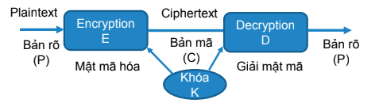

# Lưu mật khẩu người dùng, Mã hóa và Giải mã, Tấn công CSRF và cách ngăn chặn

## I. Lưu mật khẩu người dùng

### 1. Tại sao cần lưu mật khẩu một cách an toàn?
Mật khẩu là thông tin nhạy cảm, nếu bị lộ có thể dẫn đến việc tài khoản của người dùng bị xâm phạm. Do đó, việc lưu trữ mật khẩu một cách an toàn là rất quan trọng để bảo vệ người dùng và hệ thống.

### 2. Cách lưu mật khẩu an toàn
- **Không lưu mật khẩu dưới dạng plain text (văn bản thuần):** Điều này rất nguy hiểm vì nếu cơ sở dữ liệu bị xâm nhập, tất cả mật khẩu sẽ bị lộ.
- **Sử dụng hàm băm (hashing):** Hàm băm là một hàm một chiều, không thể đảo ngược. Một số thuật toán băm phổ biến:
  - BCrypt (Phổ biến hiện nay)
  - Argon2
  - PBKDF2

### 3. Tìm hiểu về BCrypt

#### 1. BCrypt là gì?
BCrypt là một thuật toán băm mật khẩu được thiết kế để bảo vệ mật khẩu người dùng. Nó được phát triển dựa trên thuật toán mã hóa Blowfish và được tối ưu hóa để chống lại các cuộc tấn công brute force.

#### 2. Đặc điểm nổi bật của BCrypt
- **Salt:** Mỗi mật khẩu được băm với một giá trị salt ngẫu nhiên, giúp ngăn chặn các cuộc tấn công rainbow table.
- **Chi phí tính toán (Cost Factor):** BCrypt cho phép điều chỉnh độ phức tạp của thuật toán thông qua tham số cost. Giá trị cost càng cao thì thời gian băm càng lâu, giúp tăng cường bảo mật.
- **Hàm băm một chiều:** Kết quả băm không thể đảo ngược để lấy lại mật khẩu gốc.

#### 3. Cách hoạt động của BCrypt
1. **Tạo Salt:** Một giá trị salt ngẫu nhiên được tạo ra.
2. **Kết hợp Salt và Mật khẩu:** Salt được kết hợp với mật khẩu để tạo ra một chuỗi duy nhất.
3. **Băm:** Chuỗi kết hợp được băm nhiều lần dựa trên giá trị cost.
4. **Kết quả:** Kết quả cuối cùng bao gồm cả giá trị salt và mật khẩu đã băm.

#### 4. Cách sử dụng BCrypt trong dự án
Trong dự án, BCrypt được sử dụng để băm mật khẩu người dùng:
```java
PasswordEncoder passwordEncoder = new BCryptPasswordEncoder(10);
String hashedPassword = passwordEncoder.encode("password123");
```
- `BCryptPasswordEncoder` là lớp của Spring Security để băm mật khẩu.
- Tham số `10` là cost factor, xác định số lần lặp băm. Giá trị này có thể được điều chỉnh để cân bằng giữa hiệu suất và bảo mật.

#### 5. Kiểm tra mật khẩu với BCrypt
Khi người dùng đăng nhập, mật khẩu nhập vào được kiểm tra với mật khẩu đã băm:
```java
boolean matches = passwordEncoder.matches(rawPassword, hashedPassword);
```
- `matches` trả về `true` nếu mật khẩu khớp.

#### 6. Lợi ích của BCrypt
- **Bảo vệ chống lại brute force:** Thời gian băm lâu giúp giảm tốc độ thử mật khẩu.
- **Ngăn chặn rainbow table:** Giá trị salt ngẫu nhiên làm cho mỗi mật khẩu băm là duy nhất.
- **Dễ sử dụng:** Được tích hợp sẵn trong Spring Security.

#### 7. Hạn chế của BCrypt
- **Hiệu suất:** Với giá trị cost cao, thời gian băm sẽ lâu hơn, có thể ảnh hưởng đến hiệu suất hệ thống.
- **Không phù hợp cho dữ liệu lớn:** BCrypt chỉ phù hợp để băm mật khẩu, không phù hợp cho các loại dữ liệu lớn.

#### 8. Kết luận
BCrypt là một lựa chọn tuyệt vời để bảo vệ mật khẩu người dùng nhờ vào tính bảo mật cao và khả năng chống lại các cuộc tấn công brute force. Trong dự án, việc sử dụng BCrypt giúp đảm bảo rằng mật khẩu người dùng được lưu trữ một cách an toàn.


---

## II. Mã hóa và Giải mã

### 1. Mã hóa là gì?
Mã hóa là quá trình chuyển đổi dữ liệu từ dạng dễ đọc sang dạng không thể đọc được nếu không có khóa giải mã. Mã hóa thường được sử dụng để bảo vệ dữ liệu nhạy cảm khi truyền tải qua mạng.

### 2. Giải mã là gì?
Giải mã là quá trình ngược lại của mã hóa, chuyển đổi dữ liệu từ dạng mã hóa về dạng dễ đọc bằng cách sử dụng khóa giải mã.

### 3. Ví dụ trong dự án
Trong dự án, mã hóa JWT (JSON Web Token) được sử dụng để bảo mật thông tin người dùng:
```java
String token = Jwts.builder()
        .setSubject(username)
        .claim("roles", roles)
        .signWith(SignatureAlgorithm.HS256, "a-string-secret-at-least-256-bits-long")
        .compact();
```
- `signWith` sử dụng thuật toán `HS256` và một chuỗi bí mật để mã hóa token.
- Token sau khi mã hóa sẽ được gửi đến client.

Khi nhận được token, server sẽ giải mã để xác thực:
```java
Claims claims = Jwts.parser()
        .setSigningKey("a-string-secret-at-least-256-bits-long")
        .parseClaimsJws(token)
        .getBody();
```
- `parseClaimsJws` giải mã token và trích xuất thông tin bên trong.

---

## III. Tấn công CSRF (Cross-Site Request Forgery)

### 1. CSRF là gì?
CSRF (Cross-Site Request Forgery) là một cuộc tấn công mà một trang web độc hại lừa trình duyệt của người dùng thực hiện các hành động không mong muốn trên một trang web đáng tin cậy mà người dùng đã đăng nhập.


- **Ví dụ**:
    - Người dùng đã đăng nhập vào một trang web ngân hàng.
    - Kẻ tấn công lừa người dùng nhấp vào một liên kết độc hại, dẫn đến việc chuyển tiền mà không có sự đồng ý của người dùng.
### 2. Cách phòng chống tấn công CSRF

Dựa trên nguyên tắc của CSRF là *"lừa trình duyệt của người dùng (hoặc người dùng) gửi các câu lệnh HTTP"*, thông thường để tránh tấn công ta sẽ chia làm hai đối tượng: phía **Client** (người dùng cuối) và phía **Server**.
#### 1. Phía User (Người dùng)

Để tránh trở thành nạn nhân của các cuộc tấn công CSRF nên thực hiện một số lưu ý sau:

* **Đăng xuất (Logout):** Nên đăng xuất khỏi các website quan trọng (Tài khoản ngân hàng, thanh toán trực tuyến, các mạng xã hội, gmail…) khi đã thực hiện xong giao dịch.
* **Thiết bị cá nhân:** Nên login vào một máy riêng và không cho người thứ 2 tiếp xúc với máy đó.
* **Cẩn trọng với liên kết:** Không nên click vào các đường dẫn mà bạn nhận được qua email, qua facebook… Khi bạn đưa chuột qua 1 đường dẫn, phía dưới bên trái của trình duyệt thường có địa chỉ website đích, bạn nên lưu ý để đến đúng trang mình muốn.
* **Không lưu mật khẩu:** Không lưu các thông tin về mật khẩu tại trình duyệt của mình. Không nên chọn các phương thức “đăng nhập lần sau”, “lưu mật khẩu”…
* **Tập trung khi giao dịch:** Trong quá trình thực hiện giao dịch hay vào các website quan trọng không nên vào các website khác, vì có thể chứa các mã khai thác của kẻ tấn công.

#### 2. Phía Server (Máy chủ)

Cho đến nay vẫn chưa có biện pháp nào có thể phòng chống triệt để CSRF. Sau đây là một vài kĩ thuật thường được sử dụng:

* **Sử dụng Captcha và thông báo xác nhận:**
    * Captcha được sử dụng để nhận biết đối tượng đang thao tác với hệ thống là con người hay không.
    * Các thao tác quan trọng như "đăng nhập", "chuyển khoản", "thanh toán" thường hay sử dụng captcha.
    * Những chức năng quan trọng như reset mật khẩu, xác nhận thay đổi info của account cũng nên gửi URL qua email đã đăng ký để người dùng có thể click vào xác nhận.


* **Sử dụng `csrf_token`:**
    * Token này sẽ thay đổi liên tục trong phiên làm việc, và khi thay đổi thông tin sẽ gửi kèm thông tin token này.
    * Nếu token được sinh ra và token được gửi lên không trùng nhau thì loại bỏ request.


* **Sử dụng cookie riêng biệt cho trang Admin:**
    * Nên để trang quản trị ở một subdomain riêng để chúng không dùng chung cookies với front-end của sản phẩm.
    * Ví dụ: Nên đặt là `admin.topdev.vn` thay vì `topdev.vn/admin`.


* **Kiểm tra IP:**
    * Một số hệ thống quan trọng chỉ cho truy cập từ những IP được thiết lập sẵn, hoặc chỉ cấp phép truy cập quản trị qua IP local hoặc VPN.
### **Cách ngăn chặn CSRF**
Dự án sử dụng Spring Security, cung cấp sẵn tính năng bảo vệ CSRF.

- **Token CSRF**:
    - Spring Security tạo một token CSRF duy nhất cho mỗi phiên.
    - Token này phải được bao gồm trong các yêu cầu thay đổi dữ liệu trên máy chủ (ví dụ: POST, PUT, DELETE).

- **Cách triển khai**:
    - Bảo vệ CSRF được bật mặc định trong Spring Security.
    - Để tắt CSRF cho các endpoint cụ thể (ví dụ: API công khai), bạn có thể cấu hình trong lớp `SecurityConfig`:
      ```java
      http.csrf(AbstractHttpConfigurer::disable);
      ```


### 3. Ví dụ trong dự án
Trong dự án, Spring Security được cấu hình để bảo vệ chống lại CSRF:
```java
@Override
protected void configure(HttpSecurity http) throws Exception {
    http
        .csrf()
        .csrfTokenRepository(CookieCsrfTokenRepository.withHttpOnlyFalse());
}
```
- `CookieCsrfTokenRepository` lưu trữ CSRF token trong cookie.
- Token sẽ được tự động kiểm tra trong các yêu cầu tiếp theo.

---

